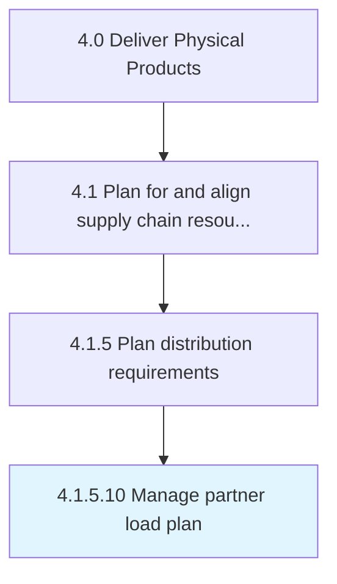

# Manage partner load plan

> Administering the load plan for partners.

## Overview

Activity 4.1.5.10 is an activity within the Deliver Physical Products framework. 

Administering the load plan for partners. Manage the delivery, and dispatch from the source to the partners.

## Process Hierarchy



## Key Statistics

| Metric | Value |
|--------|-------|
| APQC Code | 10261 |
| Hierarchy ID | 4.1.5.10 |
| Level | Activity |
| Parent | [4.1.5](../) |
| Sub-Processes | 0 |


## GraphDL Semantic Structure

```
manage.PartnerLoadPlan
```

| Component | Value | Description |
|-----------|-------|-------------|
| Verb | `manage` | Primary action |
| Object | `partner load plan` | Direct object |


## Related Concepts

- [PartnerLoadPlan](/concepts/PartnerLoadPlan)


---

*Source: APQC PCF 10261 (4.1.5.10) - APQC*
