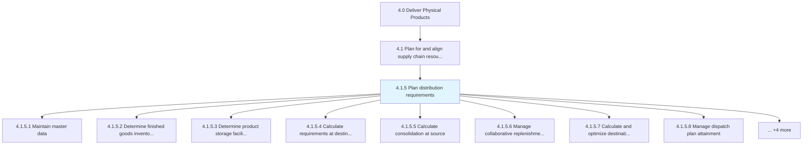
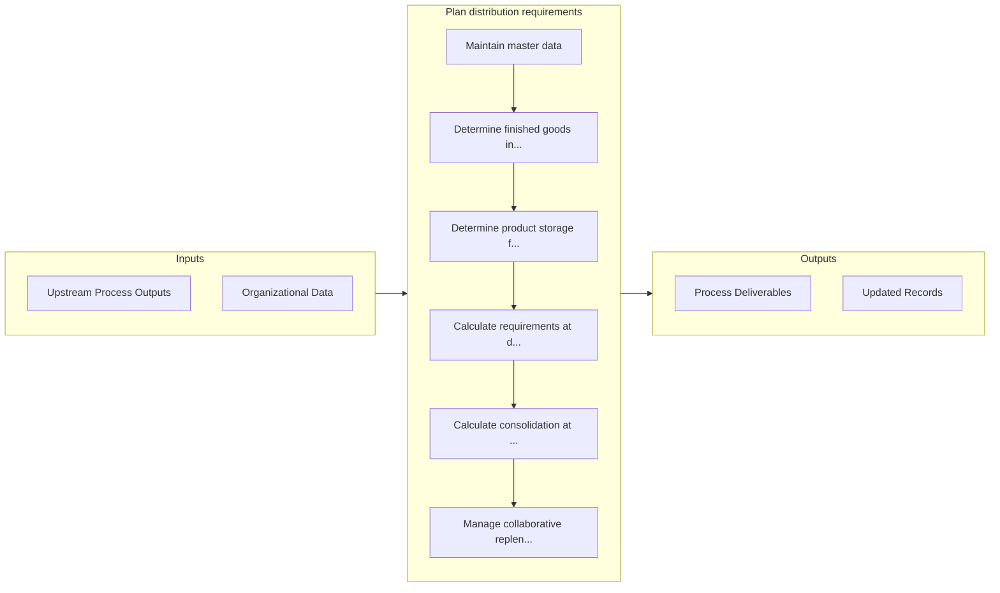

# Plan distribution requirements

> Maintaining master data of finished products and inventory.

## Overview

Process 4.1.5 is a core process that defines the specific procedures for plan distribution requirements. 

Maintaining master data of finished products and inventory. Identify the requirements of finished products at the destination, as well as partner requirements. Calculate the consolidation at source. Manage replenishment planning. Create and administer a dispatch plan. Calculate load plans for destinations and partners. Manage the cost of supplying these products. Ensure effective utilization of capacity.

## Process Hierarchy



## Key Statistics

| Metric | Value |
|--------|-------|
| APQC Code | 17042 |
| Hierarchy ID | 4.1.5 |
| Level | Process |
| Parent | [4.1](../) |
| Sub-Processes | 12 |


## GraphDL Semantic Structure

```
plan.DistributionRequirements
```

| Component | Value | Description |
|-----------|-------|-------------|
| Verb | `plan` | Primary action |
| Object | `distribution requirements` | Direct object |


## Process Flow



## Sub-Processes

| Process | Hierarchy ID | Description |
|---------|-------------|-------------|
| [Maintain master data](./MaintainMasterData) | 4.1.5.1 | Maintaining and preserving the master data plan for distribution requirements |
| [Determine finished goods inventory requirements at destination](./DetermineFinishedGoodsInventoryRequirementsAtDestination) | 4.1.5.2 | Interact with the concerned person at the destination to validate the requirements and to avoid any  |
| [Determine product storage facility requirements](./DetermineProductStorageFacilityRequirements) | 4.1.5.3 | Evaluate constraints, needs, parameters, and conditions for physical storage and retrieval of compon |
| [Calculate requirements at destination](./CalculateRequirementsAtDestination) | 4.1.5.4 | Interact with the concerned authority at the destination to reach a specific figure that correctly r |
| [Calculate consolidation at source](./CalculateConsolidationAtSource) | 4.1.5.5 | Determining the aggregate volume of products/services consolidated at the source |
| [Manage collaborative replenishment planning](./ManageCollaborativeReplenishmentPlanning) | 4.1.5.6 | Administering the plan for collaborative replenishment of goods |
| [Calculate and optimize destination dispatch plan](./CalculateAndOptimizeDestinationDispatchPlan) | 4.1.5.7 | Estimating the timing and duration of the delivery of the inventory from the source to the destinati |
| [Manage dispatch plan attainment](./ManageDispatchPlanAttainment) | 4.1.5.8 | Accomplishing the dispatch plan |
| [Calculate and optimize destination load plans](./CalculateAndOptimizeDestinationLoadPlans) | 4.1.5.9 | Evaluating the plans for delivering loads to destinations |
| [Manage partner load plan](./ManagePartnerLoadPlan) | 4.1.5.10 | Administering the load plan for partners |
| [Manage cost of supply](./ManageCostOfSupply) | 4.1.5.11 | Managing all expenses to provide products/services in the market |
| [Manage capacity utilization](./ManageCapacityUtilization) | 4.1.5.12 | Determining the capacity utilization of the organization's production process |


## Related Concepts

- DistributionRequirements


---

*Source: APQC PCF 17042 (4.1.5) - APQC*
