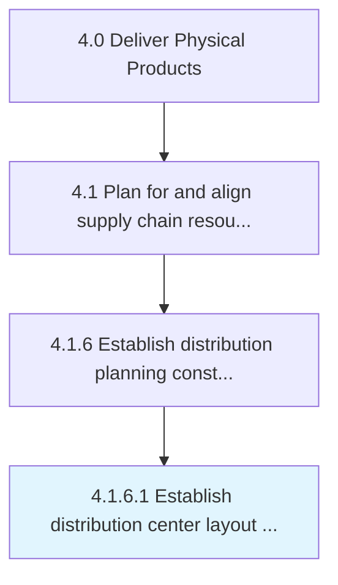

# Establish distribution center layout constraints

> Instituting the constraints for creating a layout for distribution center.

## Overview

Activity 4.1.6.1 is an activity within the Deliver Physical Products framework. 

Instituting the constraints for creating a layout for distribution center. Consider factors such as the number of customers, demand forecasting, product groups, condition of product conservation, warehousing, and transportation management.

## Process Hierarchy



## Key Statistics

| Metric | Value |
|--------|-------|
| APQC Code | 10267 |
| Hierarchy ID | 4.1.6.1 |
| Level | Activity |
| Parent | [4.1.6](../) |
| Sub-Processes | 0 |


## GraphDL Semantic Structure

```
establish.DistributionCenterLayoutConstraints
```

| Component | Value | Description |
|-----------|-------|-------------|
| Verb | `establish` | Primary action |
| Object | `distribution center layout constraints` | Direct object |


## Related Concepts

- [DistributionCenterLayoutConstraints](/concepts/DistributionCenterLayoutConstraints)


---

*Source: APQC PCF 10267 (4.1.6.1) - APQC*
