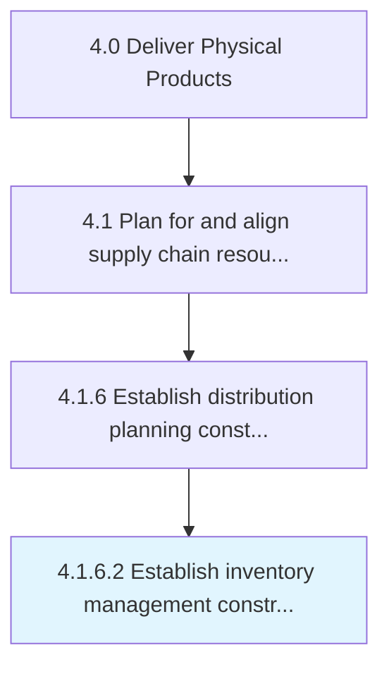

# Establish inventory management constraints

> Determining any problems that might be faced while managing inventory.

## Overview

Activity 4.1.6.2 is an activity within the Deliver Physical Products framework. 

Determining any problems that might be faced while managing inventory. Identify problems and possible issues in managing the warehousing of the raw materials, spares, and other items of inventory. Take stock of inventory needs, and determine the exact quantity of the inventory needed in the near future.

## Process Hierarchy



## Key Statistics

| Metric | Value |
|--------|-------|
| APQC Code | 10268 |
| Hierarchy ID | 4.1.6.2 |
| Level | Activity |
| Parent | [4.1.6](../) |
| Sub-Processes | 0 |


## GraphDL Semantic Structure

```
establish.InventoryManagementConstraints
```

| Component | Value | Description |
|-----------|-------|-------------|
| Verb | `establish` | Primary action |
| Object | `inventory management constraints` | Direct object |


## Related Concepts

- [InventoryManagementConstraints](/concepts/InventoryManagementConstraints)


---

*Source: APQC PCF 10268 (4.1.6.2) - APQC*
