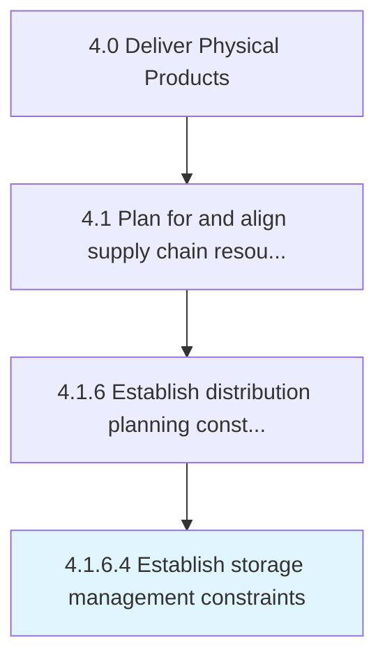

# Establish storage management constraints

> Determining potential constraints for physical storage and retrieval of components or products in a storage facility within a certain timeframe.

## Overview

Activity 4.1.6.4 is an activity within the Deliver Physical Products framework. 

Determining potential constraints for physical storage and retrieval of components or products in a storage facility within a certain timeframe. Consider factors such as the building shape, height, capacity, door locations, lift equipment, automation, etc.

## Process Hierarchy



## Key Statistics

| Metric | Value |
|--------|-------|
| APQC Code | 19558 |
| Hierarchy ID | 4.1.6.4 |
| Level | Activity |
| Parent | [4.1.6](../) |
| Sub-Processes | 0 |


## GraphDL Semantic Structure

```
establish.StorageManagementConstraints
```

| Component | Value | Description |
|-----------|-------|-------------|
| Verb | `establish` | Primary action |
| Object | `storage management constraints` | Direct object |


## Related Concepts

- [StorageManagementConstraints](/concepts/StorageManagementConstraints)


---

*Source: APQC PCF 19558 (4.1.6.4) - APQC*
