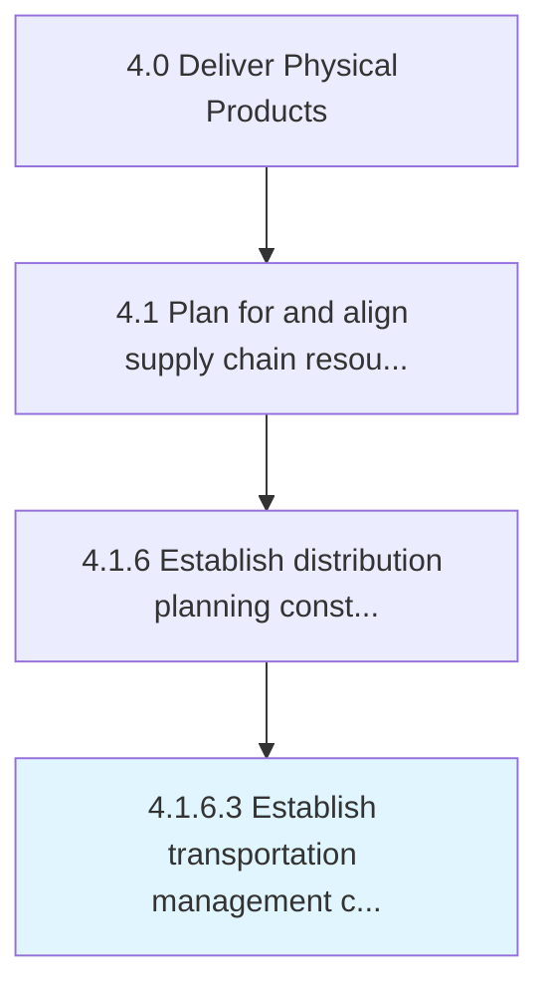

# Establish transportation management constraints

> Identifying any potential constraints while deciding on the dispatch and delivery plan from the source to the various distribution centers.

## Overview

Activity 4.1.6.3 is an activity within the Deliver Physical Products framework. 

Identifying any potential constraints while deciding on the dispatch and delivery plan from the source to the various distribution centers. Decide how the inventory will be transported , which and how many transportation means to use, what route to take, etc.

## Process Hierarchy



## Key Statistics

| Metric | Value |
|--------|-------|
| APQC Code | 10269 |
| Hierarchy ID | 4.1.6.3 |
| Level | Activity |
| Parent | [4.1.6](../) |
| Sub-Processes | 0 |


## GraphDL Semantic Structure

```
establish.TransportationManagementConstraints
```

| Component | Value | Description |
|-----------|-------|-------------|
| Verb | `establish` | Primary action |
| Object | `transportation management constraints` | Direct object |


## Related Concepts

- TransportationManagementConstraints


---

*Source: APQC PCF 10269 (4.1.6.3) - APQC*
