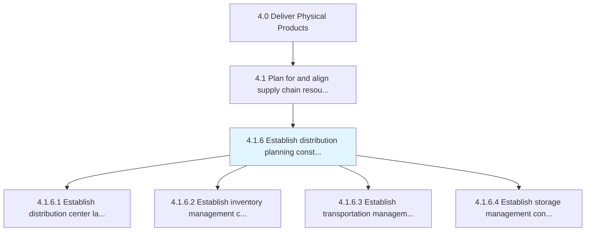
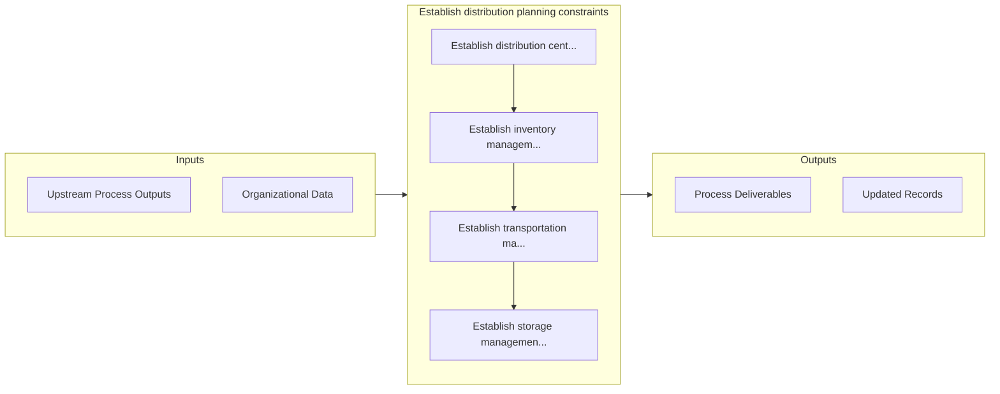

# Establish distribution planning constraints

> Instituting the constraints for planning of distribution process.

## Overview

Process 4.1.6 is a core process that defines the specific procedures for establish distribution planning constraints. 

Instituting the constraints for planning of distribution process. Create a plan that specifies every element in the distribution process from the blueprint of the distribution centers to how and when the inventory would reach the distribution centers.

## Process Hierarchy



## Key Statistics

| Metric | Value |
|--------|-------|
| APQC Code | 10226 |
| Hierarchy ID | 4.1.6 |
| Level | Process |
| Parent | [4.1](../) |
| Sub-Processes | 4 |


## GraphDL Semantic Structure

```
establish.DistributionPlanningConstraints
```

| Component | Value | Description |
|-----------|-------|-------------|
| Verb | `establish` | Primary action |
| Object | `distribution planning constraints` | Direct object |


## Process Flow



## Sub-Processes

| Process | Hierarchy ID | Description |
|---------|-------------|-------------|
| [Establish distribution center layout constraints](./EstablishDistributionCenterLayoutConstraints) | 4.1.6.1 | Instituting the constraints for creating a layout for distribution center |
| [Establish inventory management constraints](./EstablishInventoryManagementConstraints) | 4.1.6.2 | Determining any problems that might be faced while managing inventory |
| [Establish transportation management constraints](./EstablishTransportationManagementConstraints) | 4.1.6.3 | Identifying any potential constraints while deciding on the dispatch and delivery plan from the sour |
| [Establish storage management constraints](./EstablishStorageManagementConstraints) | 4.1.6.4 | Determining potential constraints for physical storage and retrieval of components or products in a  |


## Related Concepts

- [DistributionPlanningConstraints](/concepts/DistributionPlanningConstraints)


---

*Source: APQC PCF 10226 (4.1.6) - APQC*
