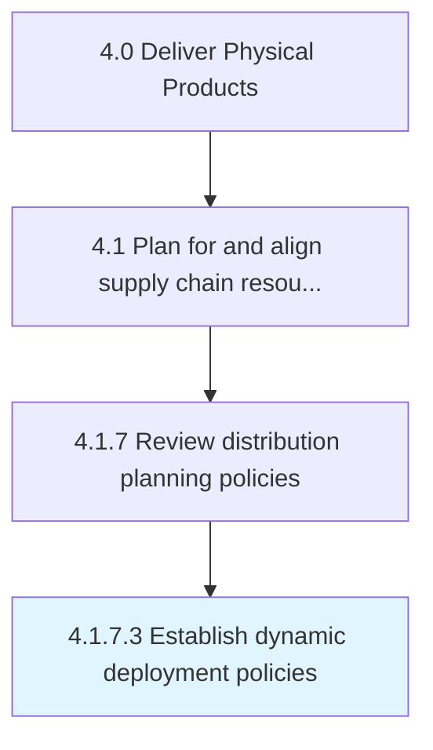

# Establish dynamic deployment policies

> Creating strategic guidelines on the availability of the products at all the distribution centers.

## Overview

Activity 4.1.7.3 is an activity within the Deliver Physical Products framework. 

Creating strategic guidelines on the availability of the products at all the distribution centers. Create a dynamic network to ensure availability at all times, even in cases of defaults.

## Process Hierarchy



## Key Statistics

| Metric | Value |
|--------|-------|
| APQC Code | 10266 |
| Hierarchy ID | 4.1.7.3 |
| Level | Activity |
| Parent | [4.1.7](../) |
| Sub-Processes | 0 |


## GraphDL Semantic Structure

```
establish.DynamicDeploymentPolicies
```

| Component | Value | Description |
|-----------|-------|-------------|
| Verb | `establish` | Primary action |
| Object | `dynamic deployment policies` | Direct object |


## Related Concepts

- [DynamicDeploymentPolicies](/concepts/DynamicDeploymentPolicies)


---

*Source: APQC PCF 10266 (4.1.7.3) - APQC*
