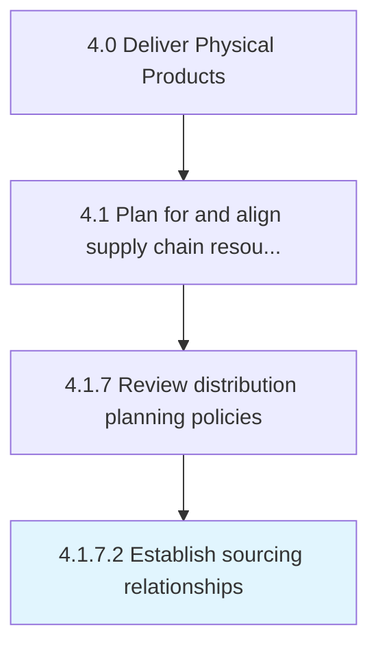

# Establish sourcing relationships

> Establishing relationships with transportation/distribution sources in order to ensure an effective distribution network and strategy.

## Overview

Activity 4.1.7.2 is an activity within the Deliver Physical Products framework. 

Establishing relationships with transportation/distribution sources in order to ensure an effective distribution network and strategy. Screen and evaluate various sources available to pick out the best among them.

## Process Hierarchy



## Key Statistics

| Metric | Value |
|--------|-------|
| APQC Code | 10265 |
| Hierarchy ID | 4.1.7.2 |
| Level | Activity |
| Parent | [4.1.7](../) |
| Sub-Processes | 0 |


## GraphDL Semantic Structure

```
establish.SourcingRelationships
```

| Component | Value | Description |
|-----------|-------|-------------|
| Verb | `establish` | Primary action |
| Object | `sourcing relationships` | Direct object |


## Related Concepts

- [SourcingRelationships](/concepts/SourcingRelationships)


---

*Source: APQC PCF 10265 (4.1.7.2) - APQC*
