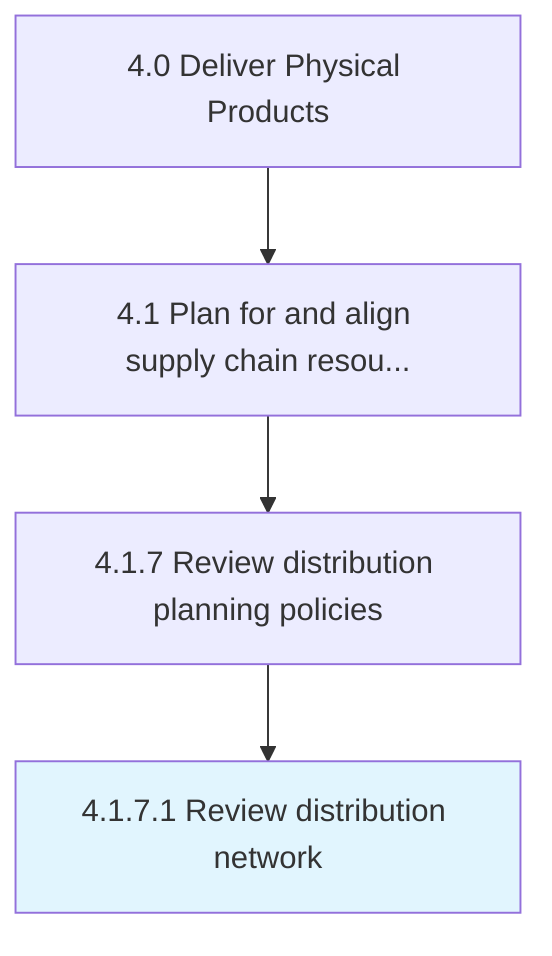

# Review distribution network

> Evaluating the system that defines how the products/inventory would reach from the source (i.

## Overview

Activity 4.1.7.1 is an activity within the Deliver Physical Products framework. 

Evaluating the system that defines how the products/inventory would reach from the source (i.e., manufacturer) to the destination (i.e., retailer/distributer).

## Process Hierarchy



## Key Statistics

| Metric | Value |
|--------|-------|
| APQC Code | 10264 |
| Hierarchy ID | 4.1.7.1 |
| Level | Activity |
| Parent | [4.1.7](../) |
| Sub-Processes | 0 |


## GraphDL Semantic Structure

```
review.DistributionNetwork
```

| Component | Value | Description |
|-----------|-------|-------------|
| Verb | `review` | Primary action |
| Object | `distribution network` | Direct object |


## Related Concepts

- [DistributionNetwork](/concepts/DistributionNetwork)


---

*Source: APQC PCF 10264 (4.1.7.1) - APQC*
