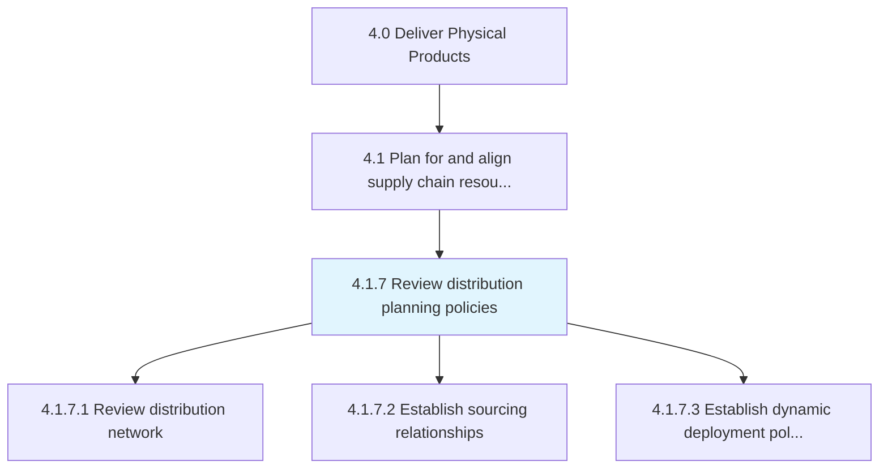
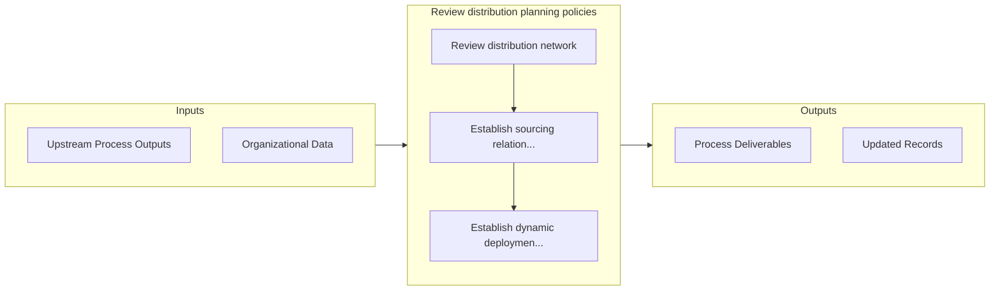

# Review distribution planning policies

> Revisiting and refurbishing the policies for planning the distribution process.

## Overview

Process 4.1.7 is a core process that defines the specific procedures for review distribution planning policies. 

Revisiting and refurbishing the policies for planning the distribution process. Asses the distribution strategies, including how the products are to be made available and sent to different distributors. Set guidelines regarding relationships between the sources and the distribution centers.

## Process Hierarchy



## Key Statistics

| Metric | Value |
|--------|-------|
| APQC Code | 10227 |
| Hierarchy ID | 4.1.7 |
| Level | Process |
| Parent | [4.1](../) |
| Sub-Processes | 3 |


## GraphDL Semantic Structure

```graphdl
review.DistributionPlanningPolicies
```

| Component | Value | Description |
|-----------|-------|-------------|
| Verb | `review` | Primary action |
| Object | `distribution planning policies` | Direct object |


## Process Flow



## Sub-Processes

| Process | Hierarchy ID | Description |
|---------|-------------|-------------|
| [Review distribution network](./ReviewDistributionNetwork) | 4.1.7.1 | Evaluating the system that defines how the products/inventory would reach from the source (i |
| [Establish sourcing relationships](./EstablishSourcingRelationships) | 4.1.7.2 | Establishing relationships with transportation/distribution sources in order to ensure an effective  |
| [Establish dynamic deployment policies](./EstablishDynamicDeploymentPolicies) | 4.1.7.3 | Creating strategic guidelines on the availability of the products at all the distribution centers |


## Related Concepts

- DistributionPlanningPolicies


---

*Source: APQC PCF 10227 (4.1.7) - APQC*
