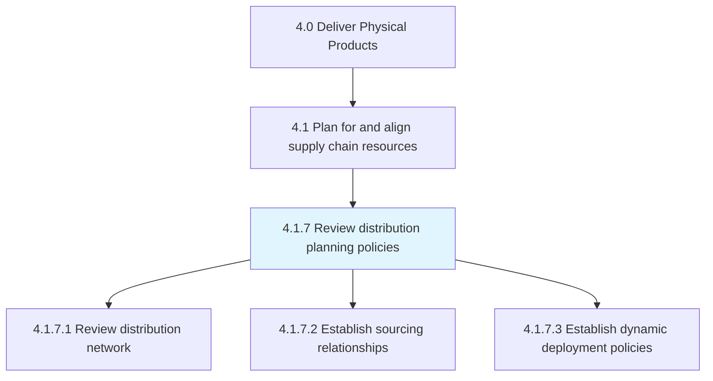
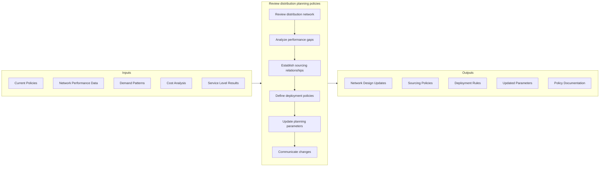

# Review distribution planning policies

> Revisiting and refurbishing the policies for planning the distribution process.

## Overview

Process 4.1.7 is a core process within [Plan for and Align Supply Chain Resources](../) that ensures distribution strategies and policies remain aligned with business objectives and market conditions. This process evaluates the effectiveness of the distribution network and updates policies to optimize inventory positioning, reduce costs, and improve service levels.

Distribution planning policies govern decisions about where to position inventory, how to allocate products across the network, and the rules for replenishment and deployment. Effective policies balance customer service requirements with cost efficiency, considering factors like lead times, demand variability, transportation costs, and inventory carrying costs. Regular review ensures policies adapt to changes in demand patterns, network structure, and competitive requirements.

## Process Hierarchy



## Key Statistics

| Metric | Value |
|--------|-------|
| APQC Code | 10227 |
| Hierarchy ID | 4.1.7 |
| Level | Process |
| Parent | [4.1](../) |
| Sub-Processes | 3 |

## GraphDL Semantic Structure

```graphdl
review.DistributionPolicies.for.Planning
```

| Component | Value | Description |
|-----------|-------|-------------|
| Verb | `review` | Primary action of evaluating |
| Object | `DistributionPolicies` | Rules governing distribution |
| Preposition | `for` | Purpose relationship |
| PrepObject | `Planning` | Strategic decision-making |

## Process Flow



## Sub-Processes

| Process | Hierarchy ID | Description |
|---------|-------------|-------------|
| [Review distribution network](./ReviewDistributionNetwork) | 4.1.7.1 | Evaluating network structure, locations, and capacity alignment |
| [Establish sourcing relationships](./EstablishSourcingRelationships) | 4.1.7.2 | Defining source-to-destination flows and supplier/DC relationships |
| [Establish dynamic deployment policies](./EstablishDynamicDeploymentPolicies) | 4.1.7.3 | Creating rules for inventory positioning and rebalancing |

## RACI Matrix

| Activity | Responsible | Accountable | Consulted | Informed |
|----------|-------------|-------------|-----------|----------|
| Review network performance | Supply Chain Planning | VP Supply Chain | Operations, Finance | Leadership |
| Analyze distribution costs | Supply Chain Analytics | Planning Director | Finance, Logistics | Operations |
| Define sourcing policies | Supply Chain Planning | Planning Director | Procurement, DCs | Logistics |
| Establish deployment rules | Inventory Planning | Planning Director | Sales, DCs | Finance |
| Update system parameters | Planning/IT | Planning Director | Operations | All |
| Communicate policy changes | Supply Chain Planning | VP Supply Chain | All Functions | Leadership |

## Key Stakeholders

- **Supply Chain Planning**: Develops and maintains distribution policies
- **Distribution Centers**: Implements policies and provides operational feedback
- **Logistics**: Executes transportation aligned with policies
- **Sales/Customer Service**: Provides service level requirements
- **Finance**: Analyzes cost implications of policy decisions
- **IT**: Maintains systems supporting policy execution

## Metrics and KPIs

| Metric | Description | Target |
|--------|-------------|--------|
| Fill Rate | Orders filled completely from stock | >98% |
| Days of Supply | Inventory coverage at each location | Per policy |
| Distribution Cost per Unit | Total distribution cost / units shipped | Continuous improvement |
| Network Utilization | Capacity used vs. available | 75-85% |
| Inventory Turns | Annual inventory turnover | Industry benchmark |
| Policy Compliance | Adherence to distribution policies | >95% |
| Order Cycle Time | Time from order to delivery | Per SLA |
| Stock-Out Rate | Frequency of out-of-stock events | <2% |

## Related Departments

- [Supply Chain](/departments/SupplyChain) - Policy development and oversight
- [Logistics](/departments/SupplyChain/Logistics) - Transportation execution
- [Distribution](/departments/SupplyChain/Distribution) - DC operations
- [Finance](/departments/Finance) - Cost and inventory analysis

## Related Occupations

- [Logisticians](/occupations/Business/Logisticians) - Distribution planning
- [Supply Chain Managers](/occupations/Management/SupplyChainManagers) - Policy oversight
- [Operations Research Analysts](/occupations/Math/OperationsResearchAnalysts) - Network optimization
- [Transportation Managers](/occupations/TransportationManagers) - Logistics coordination

## Industry Variations

### Retail
Omnichannel distribution policies, store replenishment optimization, and e-commerce fulfillment network design with emphasis on last-mile delivery.

### Consumer Products
Multi-tier distribution (manufacturer to DC to retailer), promotional inventory positioning, and seasonal planning policies.

### Industrial/B2B
Regional distribution strategies, customer-specific stocking policies, and service parts distribution networks.

### Pharmaceutical
Temperature-controlled distribution policies, regulatory compliance in distribution, and product expiration management.

## Related Concepts

- DistributionNetworkDesign
- InventoryPositioning
- SupplyChainPlanning
- DeploymentOptimization
- LogisticsStrategy
- NetworkOptimization
- FulfillmentStrategy

---

*Source: APQC PCF 10227 (4.1.7) - APQC*
