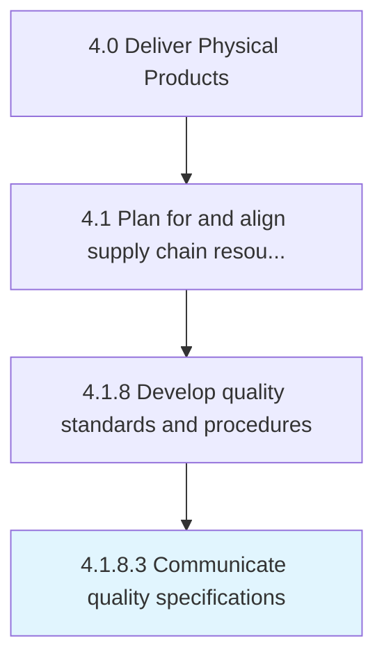

# Communicate quality specifications

> Communicating the desired quality specifications to the manufacturing units, as well as the distribution centers, to avoid any misunderstanding or misinterpretation.

## Overview

Activity 4.1.8.3 is an activity within the Deliver Physical Products framework. 

Communicating the desired quality specifications to the manufacturing units, as well as the distribution centers, to avoid any misunderstanding or misinterpretation.

## Process Hierarchy



## Key Statistics

| Metric | Value |
|--------|-------|
| APQC Code | 10373 |
| Hierarchy ID | 4.1.8.3 |
| Level | Activity |
| Parent | [4.1.8](../) |
| Sub-Processes | 0 |


## GraphDL Semantic Structure

```
communicate.QualitySpecifications
```

| Component | Value | Description |
|-----------|-------|-------------|
| Verb | `communicate` | Primary action |
| Object | `quality specifications` | Direct object |


## Related Concepts

- QualitySpecifications


---

*Source: APQC PCF 10373 (4.1.8.3) - APQC*
