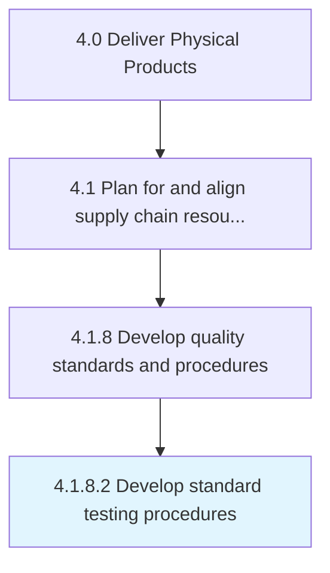

# Develop standard testing procedures

> Creating standard procedures for testing the quality of products/services.

## Overview

Activity 4.1.8.2 is an activity within the Deliver Physical Products framework. 

Creating standard procedures for testing the quality of products/services. Describe the steps of key processes to help ensure consistent and quality output. Define the routine instructions for performing the quality testing activity.

## Process Hierarchy



## Key Statistics

| Metric | Value |
|--------|-------|
| APQC Code | 10372 |
| Hierarchy ID | 4.1.8.2 |
| Level | Activity |
| Parent | [4.1.8](../) |
| Sub-Processes | 0 |


## GraphDL Semantic Structure

```
develop.StandardTestingProcedures
```

| Component | Value | Description |
|-----------|-------|-------------|
| Verb | `develop` | Primary action |
| Object | `standard testing procedures` | Direct object |


## Related Concepts

- StandardTestingProcedures


---

*Source: APQC PCF 10372 (4.1.8.2) - APQC*
