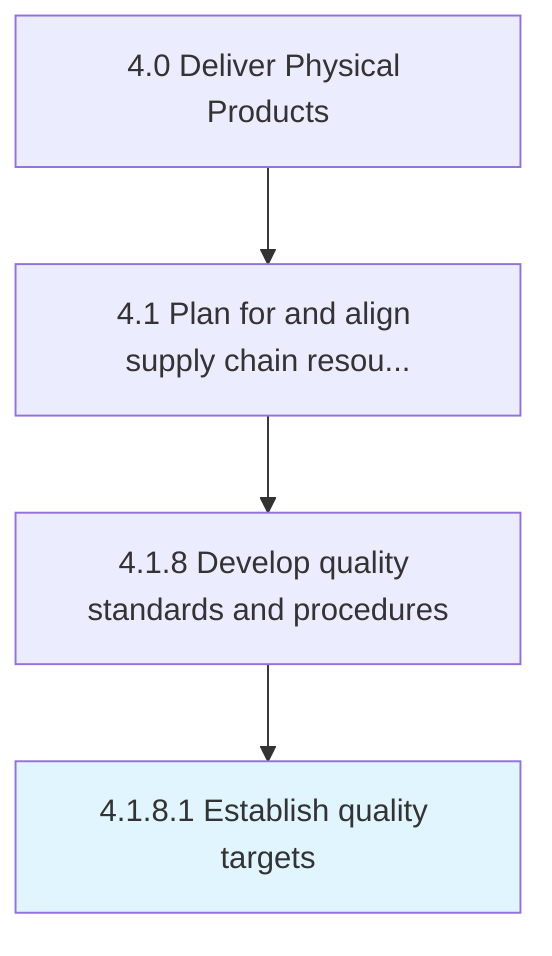

# Establish quality targets

> Defining specific qualitative and quantitative target figures.

## Overview

Activity 4.1.8.1 is an activity within the Deliver Physical Products framework. 

Defining specific qualitative and quantitative target figures.

## Process Hierarchy



## Key Statistics

| Metric | Value |
|--------|-------|
| APQC Code | 10371 |
| Hierarchy ID | 4.1.8.1 |
| Level | Activity |
| Parent | [4.1.8](../) |
| Sub-Processes | 0 |


## GraphDL Semantic Structure

```
establish.QualityTargets
```

| Component | Value | Description |
|-----------|-------|-------------|
| Verb | `establish` | Primary action |
| Object | `quality targets` | Direct object |


## Related Concepts

- QualityTargets


---

*Source: APQC PCF 10371 (4.1.8.1) - APQC*
