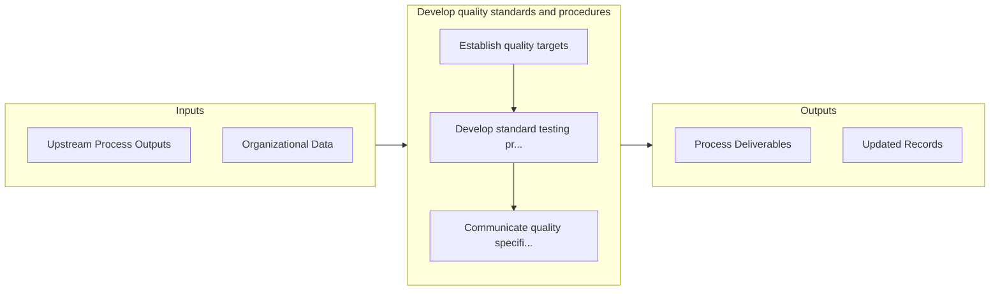

# Develop quality standards and procedures

> Developing standards and procedures for maintaining the quality of products/services.

## Overview

Process 4.1.8 is a core process that defines the specific procedures for develop quality standards and procedures. 

Developing standards and procedures for maintaining the quality of products/services. Establish desired quality targets. Create standardized procedures for the quality. Ensure quality specifications are effectively communicated.

## Process Hierarchy


## Key Statistics

| Metric | Value |
|--------|-------|
| APQC Code | 10368 |
| Hierarchy ID | 4.1.8 |
| Level | Process |
| Parent | [4.1](../) |
| Sub-Processes | 3 |


## GraphDL Semantic Structure

```
develop.QualityStandardsAndProcedures
```

| Component | Value | Description |
|-----------|-------|-------------|
| Verb | `develop` | Primary action |
| Object | `quality standards and procedures` | Direct object |


## Process Flow



## Sub-Processes

| Process | Hierarchy ID | Description |
|---------|-------------|-------------|
| [Establish quality targets](./EstablishQualityTargets) | 4.1.8.1 | Defining specific qualitative and quantitative target figures |
| [Develop standard testing procedures](./DevelopStandardTestingProcedures) | 4.1.8.2 | Creating standard procedures for testing the quality of products/services |
| [Communicate quality specifications](./CommunicateQualitySpecifications) | 4.1.8.3 | Communicating the desired quality specifications to the manufacturing units, as well as the distribu |


## Related Concepts

- QualityStandards
- Procedures


---

*Source: APQC PCF 10368 (4.1.8) - APQC*
