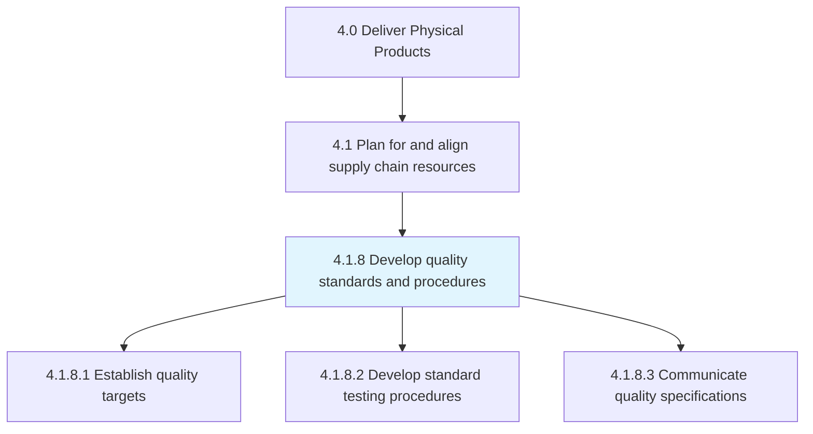
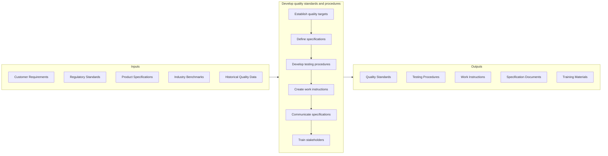

# Develop quality standards and procedures

> Developing standards and procedures for maintaining the quality of products/services.

## Overview

Process 4.1.8 is a core process within [Plan for and Align Supply Chain Resources](../) that establishes the quality framework for production operations. This process defines what quality means for each product, how it will be measured, and the procedures for ensuring consistent quality delivery.

Quality standards and procedures translate customer requirements and regulatory mandates into measurable specifications and actionable work instructions. Effective quality planning prevents defects through clear standards rather than relying solely on inspection to detect them. This process supports continuous improvement by establishing baselines and enabling measurement of quality performance.

## Process Hierarchy



## Key Statistics

| Metric | Value |
|--------|-------|
| APQC Code | 10368 |
| Hierarchy ID | 4.1.8 |
| Level | Process |
| Parent | [4.1](../) |
| Sub-Processes | 3 |

## GraphDL Semantic Structure

```graphdl
develop.QualityStandards.for.Production
```

| Component | Value | Description |
|-----------|-------|-------------|
| Verb | `develop` | Primary action of creating |
| Object | `QualityStandards` | Specifications and criteria |
| Preposition | `for` | Purpose relationship |
| PrepObject | `Production` | Manufacturing operations |

## Process Flow



## Sub-Processes

| Process | Hierarchy ID | Description |
|---------|-------------|-------------|
| [Establish quality targets](./EstablishQualityTargets) | 4.1.8.1 | Setting measurable quality goals aligned with customer and business needs |
| [Develop standard testing procedures](./DevelopStandardTestingProcedures) | 4.1.8.2 | Creating consistent, validated methods for quality verification |
| [Communicate quality specifications](./CommunicateQualitySpecifications) | 4.1.8.3 | Ensuring all stakeholders understand and can apply quality requirements |

## RACI Matrix

| Activity | Responsible | Accountable | Consulted | Informed |
|----------|-------------|-------------|-----------|----------|
| Define quality targets | Quality Engineering | Quality Director | Product, Customer | Production |
| Develop specifications | Quality Engineering | Quality Manager | Engineering, Regulatory | Supply Chain |
| Create testing procedures | Quality Engineering | Quality Manager | Production, Lab | Inspectors |
| Write work instructions | Quality/Engineering | Quality Manager | Production | Operators |
| Validate procedures | Quality Assurance | Quality Director | Regulatory | Management |
| Communicate standards | Quality Training | Quality Manager | All Functions | All Staff |

## Key Stakeholders

- **Quality Engineering**: Develops standards and procedures
- **Product Engineering**: Provides design specifications
- **Production**: Implements standards in manufacturing
- **Regulatory Affairs**: Ensures compliance with regulations
- **Customers**: Defines requirements and expectations
- **Suppliers**: Must meet incoming quality standards

## Metrics and KPIs

| Metric | Description | Target |
|--------|-------------|--------|
| Specification Coverage | Products with documented quality standards | 100% |
| Procedure Compliance | Adherence to documented procedures | >98% |
| First Pass Yield | Products meeting specs on first attempt | >98% |
| Customer Complaints | Quality-related complaints per million units | <100 PPM |
| Specification Changes | Frequency of standard revisions | Controlled |
| Training Completion | Staff trained on quality procedures | 100% |
| Audit Findings | Quality standard-related audit issues | Zero critical |
| Process Capability (Cpk) | Process capability vs. specifications | >1.33 |

## Related Departments

- [Quality Assurance](/departments/Quality) - Standard development
- [Engineering](/departments/Engineering) - Specification input
- [Manufacturing](/departments/Operations/Manufacturing) - Standard implementation
- [Regulatory Affairs](/departments/Regulatory) - Compliance alignment

## Related Occupations

- [Quality Control Inspectors](/occupations/QualityControlInspectors) - Standard application
- [Industrial Engineers](/occupations/Engineering/IndustrialEngineers) - Process design
- [Quality Assurance Managers](/occupations/Management/QualityAssuranceManagers) - Standard oversight
- [Compliance Officers](/occupations/Business/ComplianceOfficers) - Regulatory alignment

## Industry Variations

### Pharmaceutical/Life Sciences
GMP requirements, FDA/EMA compliance, validation protocols, and extensive documentation requirements for quality standards.

### Automotive
IATF 16949 standards, APQP/PPAP processes, and supplier quality requirements integrated into quality planning.

### Aerospace
AS9100 standards, special process certification, and customer-specific quality requirements.

### Food and Beverage
HACCP plans, food safety standards, and regulatory compliance for quality in food production.

## Related Concepts

- QualityManagement
- ProductSpecifications
- TestingProcedures
- QualityPlanning
- ProcessCapability
- RegulatoryCompliance
- ContinuousImprovement

---

*Source: APQC PCF 10368 (4.1.8) - APQC*
