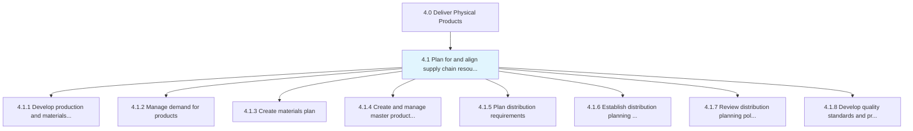
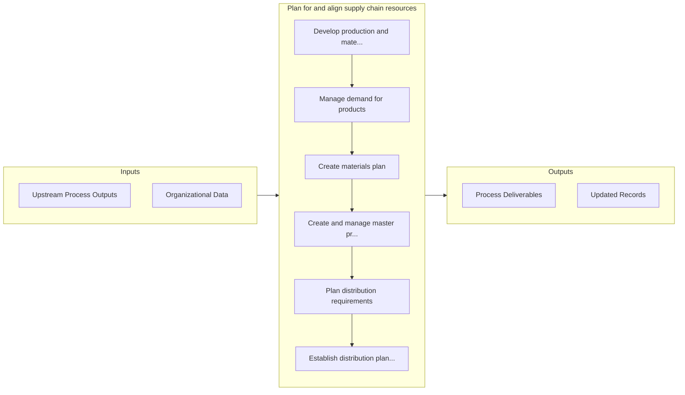

# Plan for and align supply chain resources

> Creating strategies for production and materials.

## Overview

Group 4.1 is a process group within APQC Category 4.0 (Deliver Physical Products). 

Creating strategies for production and materials. Handle the demand for the products of the organization. Develop plans for handling materials. Develop and administer the schedule for master production. Plan for distribution requirements and its constraints by reviewing and assessing distribution policies and performance and by establishing quality standards and procedures.

## Process Hierarchy



## Key Statistics

| Metric | Value |
|--------|-------|
| APQC Code | 10215 |
| Hierarchy ID | 4.1 |
| Level | Group |
| Parent | [4](../) |
| Sub-Processes | 8 |


## GraphDL Semantic Structure

```graphdl
plan.ForAndAlignSupplyChainResources
```

| Component | Value | Description |
|-----------|-------|-------------|
| Verb | `plan` | Primary action |
| Object | `for and align supply chain resources` | Direct object |


## Process Flow



## Sub-Processes

| Process | Hierarchy ID | Description |
|---------|-------------|-------------|
| [Develop production and materials strategies](./4.1.1-DevelopProductionMaterialsStrategies/) | 4.1.1 | Creating strategies for production processes, as well as the process of managing materials |
| [Manage demand for products](./4.1.2-ManageDemandProducts/) | 4.1.2 | Forecasting demand for products using secondary research and customer feedback |
| [Create materials plan](./4.1.3-CreateMaterialsPlan/) | 4.1.3 | Developing a scheme that allows for advance planning for the availability of raw materials and spare |
| [Create and manage master production schedule](./4.1.4-CreateManageMasterProduction/) | 4.1.4 | Taking care of the master production plan |
| [Plan distribution requirements](./4.1.5-PlanDistributionRequirements/) | 4.1.5 | Maintaining master data of finished products and inventory |
| [Establish distribution planning constraints](./4.1.6-EstablishDistributionPlanningConstraints/) | 4.1.6 | Instituting the constraints for planning of distribution process |
| [Review distribution planning policies](./4.1.7-ReviewDistributionPlanningPolicies/) | 4.1.7 | Revisiting and refurbishing the policies for planning the distribution process |
| [Develop quality standards and procedures](./4.1.8-DevelopQualityStandardsProcedures/) | 4.1.8 | Developing standards and procedures for maintaining the quality of products/services |


## Related Concepts

- AlignSupplyChainResources


---

*Source: APQC PCF 10215 (4.1) - APQC*
