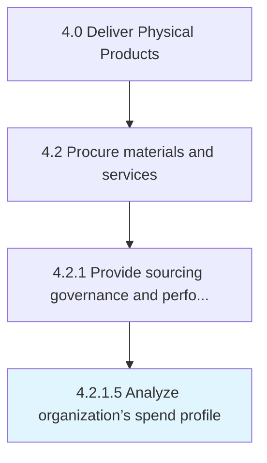

# Analyze organization’s spend profile

> Evaluating the spend profile of the organization.

## Overview

Activity 4.2.1.5 is an activity within the Deliver Physical Products framework. 

Evaluating the spend profile of the organization. Collect, cleanse, classify, and analyze the procurement data with the purpose of reducing procurement costs, improving efficiency, and monitoring compliance.

## Process Hierarchy



## Key Statistics

| Metric | Value |
|--------|-------|
| APQC Code | 10285 |
| Hierarchy ID | 4.2.1.5 |
| Level | Activity |
| Parent | [4.2.1](../) |
| Sub-Processes | 0 |


## GraphDL Semantic Structure

```
analyze.OrganizationsSpendProfile
```

| Component | Value | Description |
|-----------|-------|-------------|
| Verb | `analyze` | Primary action |
| Object | `organization’s spend profile` | Direct object |


## Related Concepts

- OrganizationSSpendProfile


---

*Source: APQC PCF 10285 (4.2.1.5) - APQC*
