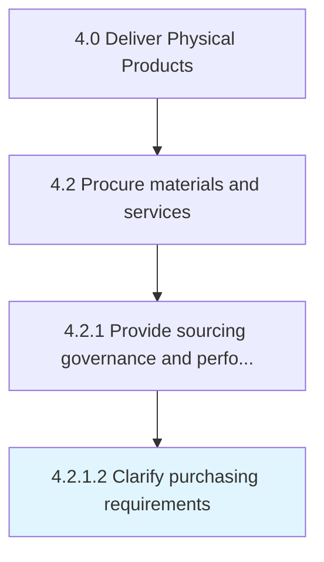

# Clarify purchasing requirements

> Defining the purchasing requirements for materials and services.

## Overview

Activity 4.2.1.2 is an activity within the Deliver Physical Products framework. 

Defining the purchasing requirements for materials and services. Specify the exact inventory required for the production process. Create a specific quotation for all the sources in order to avoid any duplication or overlap.

## Process Hierarchy



## Key Statistics

| Metric | Value |
|--------|-------|
| APQC Code | 10282 |
| Hierarchy ID | 4.2.1.2 |
| Level | Activity |
| Parent | [4.2.1](../) |
| Sub-Processes | 0 |


## GraphDL Semantic Structure

```
clarify.PurchasingRequirements
```

| Component | Value | Description |
|-----------|-------|-------------|
| Verb | `clarify` | Primary action |
| Object | `purchasing requirements` | Direct object |


## Related Concepts

- [PurchasingRequirements](/concepts/PurchasingRequirements)


---

*Source: APQC PCF 10282 (4.2.1.2) - APQC*
