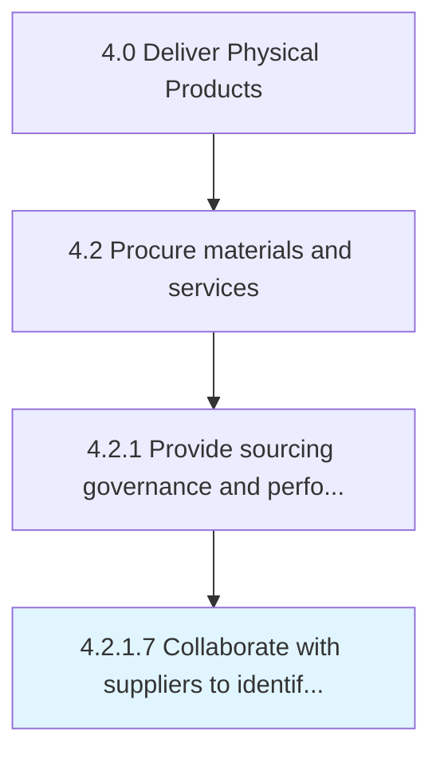

# Collaborate with suppliers to identify sourcing opportunities

> Collaborating with the suppliers of materials and services in order to determine new opportunities for sourcing.

## Overview

Activity 4.2.1.7 is an activity within the Deliver Physical Products framework. 

Collaborating with the suppliers of materials and services in order to determine new opportunities for sourcing.

## Process Hierarchy



## Key Statistics

| Metric | Value |
|--------|-------|
| APQC Code | 10287 |
| Hierarchy ID | 4.2.1.7 |
| Level | Activity |
| Parent | [4.2.1](../) |
| Sub-Processes | 0 |


## GraphDL Semantic Structure

```
collaborate.WithSuppliersToIdentifySourcingOpportunities
```

| Component | Value | Description |
|-----------|-------|-------------|
| Verb | `collaborate` | Primary action |
| Object | `with suppliers to identify sourcing opportunities` | Direct object |


## Related Concepts

- SuppliersToIdentifySourcingOpportunities


---

*Source: APQC PCF 10287 (4.2.1.7) - APQC*
