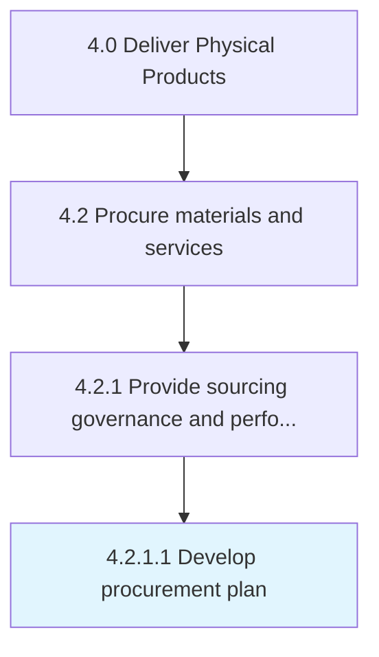

# Develop procurement plan

> Creating a plan for procuring materials and services.

## Overview

Activity 4.2.1.1 is an activity within the Deliver Physical Products framework. 

Creating a plan for procuring materials and services. Plan what to buy, when, and from what sources. Include project requirements, the procurement team, the justification for the procurement, a timeline of events, and an explanation of the supplier selection process. Outline specific actions to start and complete purchases in order to adhere to best practices.

## Process Hierarchy



## Key Statistics

| Metric | Value |
|--------|-------|
| APQC Code | 10281 |
| Hierarchy ID | 4.2.1.1 |
| Level | Activity |
| Parent | [4.2.1](../) |
| Sub-Processes | 0 |


## GraphDL Semantic Structure

```
develop.ProcurementPlan
```

| Component | Value | Description |
|-----------|-------|-------------|
| Verb | `develop` | Primary action |
| Object | `procurement plan` | Direct object |


## Related Concepts

- [ProcurementPlan](/concepts/ProcurementPlan)


---

*Source: APQC PCF 10281 (4.2.1.1) - APQC*
