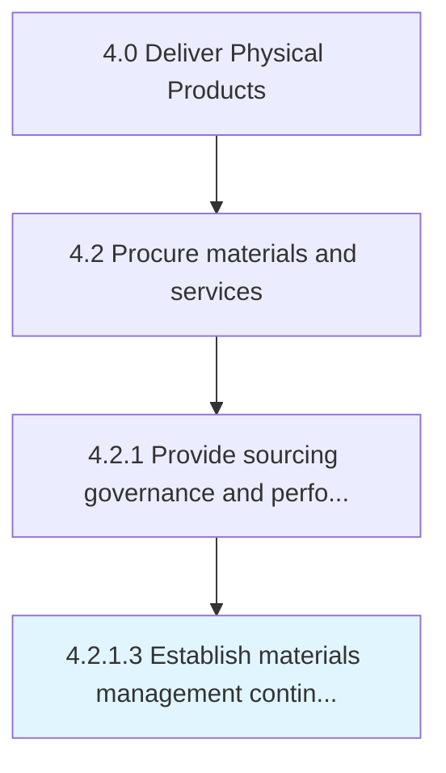

# Establish materials management contingency plans

> Developing a strategy to deal with issues projected to arise during implementation of the inventory plan.

## Overview

Activity 4.2.1.3 is an activity within the Deliver Physical Products framework. 

Developing a strategy to deal with issues projected to arise during implementation of the inventory plan. Identify how to react to issues that arise and require changes to the inventory plan, such as a vendor failing to deliver materials on time. Collaborate with production and suppliers to prepare solutions to projected problems.

## Process Hierarchy



## Key Statistics

| Metric | Value |
|--------|-------|
| APQC Code | 10283 |
| Hierarchy ID | 4.2.1.3 |
| Level | Activity |
| Parent | [4.2.1](../) |
| Sub-Processes | 0 |


## GraphDL Semantic Structure

```
establish.MaterialsManagementContingencyPlans
```

| Component | Value | Description |
|-----------|-------|-------------|
| Verb | `establish` | Primary action |
| Object | `materials management contingency plans` | Direct object |


## Related Concepts

- [MaterialsManagementContingencyPlans](/concepts/MaterialsManagementContingencyPlans)


---

*Source: APQC PCF 10283 (4.2.1.3) - APQC*
