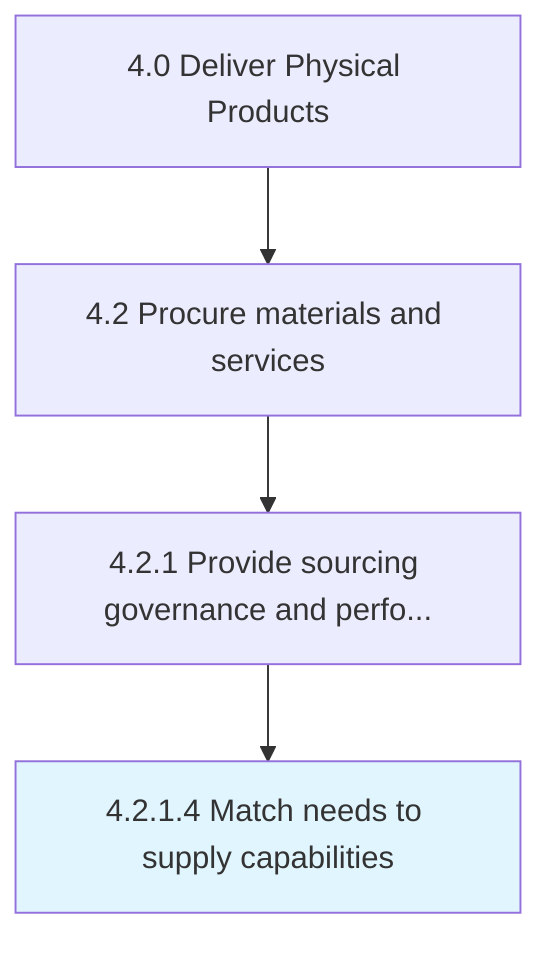

# Match needs to supply capabilities

> Synchronizing the requirements of materials and services and the capacity of suppliers for providing these materials and services.

## Overview

Activity 4.2.1.4 is an activity within the Deliver Physical Products framework. 

Synchronizing the requirements of materials and services and the capacity of suppliers for providing these materials and services. Revamp the procurement needs of the company in consideration of the capabilities of the suppliers.

## Process Hierarchy



## Key Statistics

| Metric | Value |
|--------|-------|
| APQC Code | 10284 |
| Hierarchy ID | 4.2.1.4 |
| Level | Activity |
| Parent | [4.2.1](../) |
| Sub-Processes | 0 |


## GraphDL Semantic Structure

```
match.Needs.to.SupplyCapabilities
```

| Component | Value | Description |
|-----------|-------|-------------|
| Verb | `match` | Primary action |
| Object | `needs` | Direct object |
| Preposition | `to` | Relationship |
| PrepObject | `supply capabilities` | Indirect object |


## Related Concepts

- [Needs](/concepts/Needs)
- [SupplyCapabilities](/concepts/SupplyCapabilities)


---

*Source: APQC PCF 10284 (4.2.1.4) - APQC*
