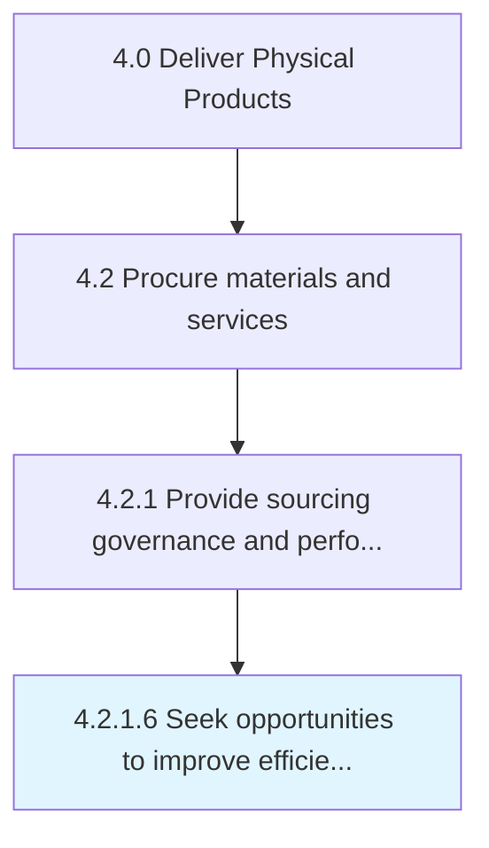

# Seek opportunities to improve efficiency and value

> Seeking the most efficient sourcing and procurement opportunities.

## Overview

Activity 4.2.1.6 is an activity within the Deliver Physical Products framework. 

Seeking the most efficient sourcing and procurement opportunities.

## Process Hierarchy



## Key Statistics

| Metric | Value |
|--------|-------|
| APQC Code | 10286 |
| Hierarchy ID | 4.2.1.6 |
| Level | Activity |
| Parent | [4.2.1](../) |
| Sub-Processes | 0 |


## GraphDL Semantic Structure

```
seek.Opportunities.to.ImproveEfficiencyAndValue
```

| Component | Value | Description |
|-----------|-------|-------------|
| Verb | `seek` | Primary action |
| Object | `opportunities` | Direct object |
| Preposition | `to` | Relationship |
| PrepObject | `improve efficiency and value` | Indirect object |


## Related Concepts

- [Opportunities](/concepts/Opportunities)
- [ImproveEfficiency](/concepts/ImproveEfficiency)
- [Opportunities](/concepts/Opportunities)
- [Value](/concepts/Value)


---

*Source: APQC PCF 10286 (4.2.1.6) - APQC*
