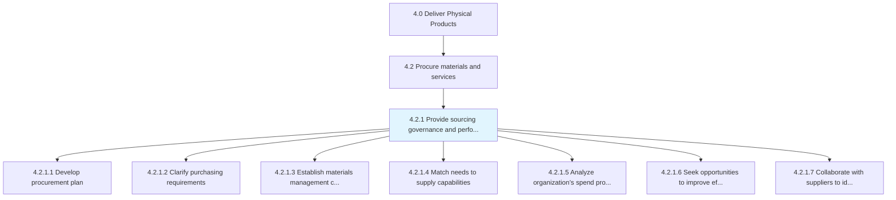
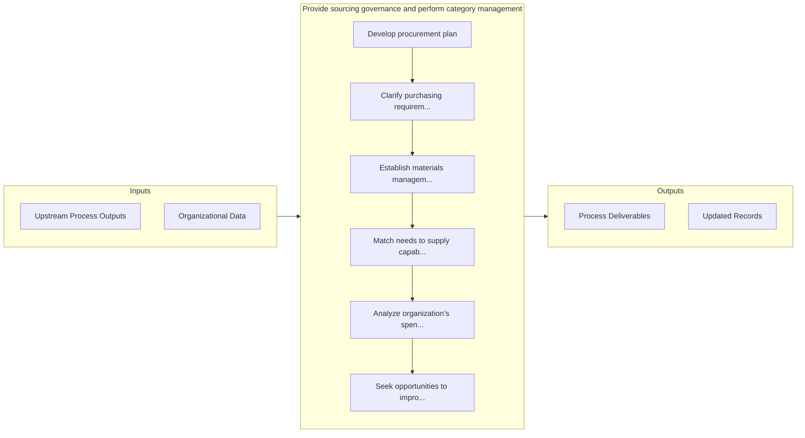

# Provide sourcing governance and perform category management

> Creating strategies for procuring materials and services from various sources, and for managing and evaluating categories.

## Overview

Process 4.2.1 is a core process that defines the specific procedures for provide sourcing governance and perform category management. 

Creating strategies for procuring materials and services from various sources, and for managing and evaluating categories. Establish a procurement process that describes the approach for obtaining products and purchasing activities. Evaluate the sources. Create sourcing relationships in order to continuously improve. Re-evaluate purchasing activities.

## Process Hierarchy



## Key Statistics

| Metric | Value |
|--------|-------|
| APQC Code | 10277 |
| Hierarchy ID | 4.2.1 |
| Level | Process |
| Parent | [4.2](../) |
| Sub-Processes | 7 |


## GraphDL Semantic Structure

```graphdl
provide.SourcingGovernanceAndPerformCategoryManagement
```

| Component | Value | Description |
|-----------|-------|-------------|
| Verb | `provide` | Primary action |
| Object | `sourcing governance and perform category management` | Direct object |


## Process Flow



## Sub-Processes

| Process | Hierarchy ID | Description |
|---------|-------------|-------------|
| [Develop procurement plan](./DevelopProcurementPlan) | 4.2.1.1 | Creating a plan for procuring materials and services |
| [Clarify purchasing requirements](./ClarifyPurchasingRequirements) | 4.2.1.2 | Defining the purchasing requirements for materials and services |
| [Establish materials management contingency plans](./EstablishMaterialsManagementContingencyPlans) | 4.2.1.3 | Developing a strategy to deal with issues projected to arise during implementation of the inventory  |
| [Match needs to supply capabilities](./MatchNeedsToSupplyCapabilities) | 4.2.1.4 | Synchronizing the requirements of materials and services and the capacity of suppliers for providing |
| [Analyze organization’s spend profile](./AnalyzeOrganizationsSpendProfile) | 4.2.1.5 | Evaluating the spend profile of the organization |
| [Seek opportunities to improve efficiency and value](./SeekOpportunitiesToImproveEfficiencyAndValue) | 4.2.1.6 | Seeking the most efficient sourcing and procurement opportunities |
| [Collaborate with suppliers to identify sourcing opportunities](./CollaborateWithSuppliersToIdentifySourcingOpportunities) | 4.2.1.7 | Collaborating with the suppliers of materials and services in order to determine new opportunities f |


## Related Concepts

- SourcingGovernance
- PerformCategoryManagement


---

*Source: APQC PCF 10277 (4.2.1) - APQC*
