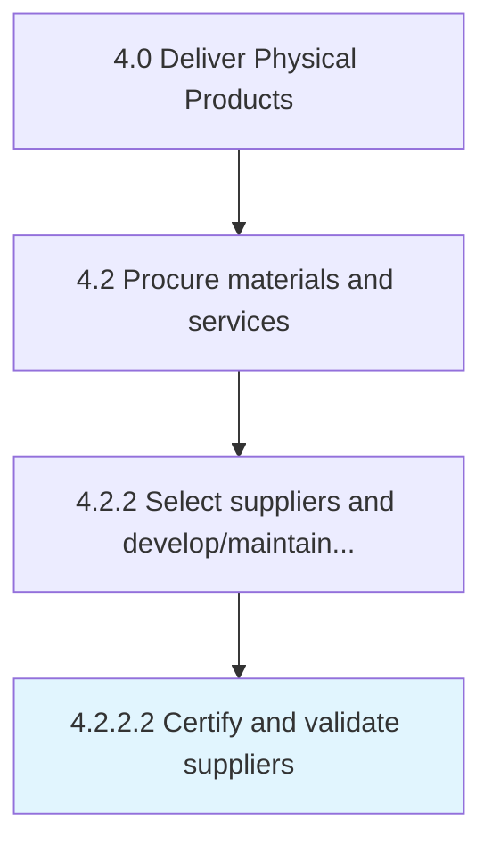

# Certify and validate suppliers

> Validating the supply sources, and provide certification as an official supplier.

## Overview

Activity 4.2.2.2 is an activity within the Deliver Physical Products framework. 

Validating the supply sources, and provide certification as an official supplier.

## Process Hierarchy



## Key Statistics

| Metric | Value |
|--------|-------|
| APQC Code | 10289 |
| Hierarchy ID | 4.2.2.2 |
| Level | Activity |
| Parent | [4.2.2](../) |
| Sub-Processes | 0 |


## GraphDL Semantic Structure

```
certify.AndValidateSuppliers
```

| Component | Value | Description |
|-----------|-------|-------------|
| Verb | `certify` | Primary action |
| Object | `and validate suppliers` | Direct object |


## Related Concepts

- [Suppliers](/concepts/Suppliers)
- [Suppliers](/concepts/Suppliers)


---

*Source: APQC PCF 10289 (4.2.2.2) - APQC*
