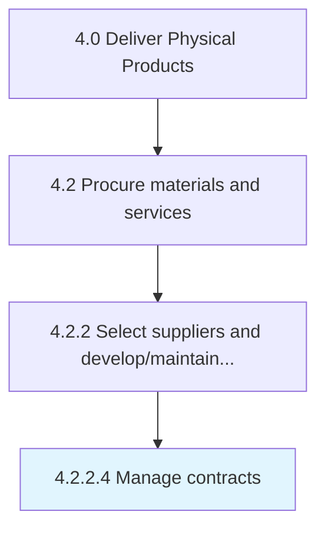

# Manage contracts

> Keeping contracts up-to-date with routine evaluation.

## Overview

Activity 4.2.2.4 is an activity within the Deliver Physical Products framework. 

Keeping contracts up-to-date with routine evaluation. Maintain order and discipline with the contracts in order to avoid any loss of information and mishaps.

## Process Hierarchy



## Key Statistics

| Metric | Value |
|--------|-------|
| APQC Code | 10291 |
| Hierarchy ID | 4.2.2.4 |
| Level | Activity |
| Parent | [4.2.2](../) |
| Sub-Processes | 0 |


## GraphDL Semantic Structure

```
manage.Contracts
```

| Component | Value | Description |
|-----------|-------|-------------|
| Verb | `manage` | Primary action |
| Object | `contracts` | Direct object |


## Related Concepts

- [Contracts](/concepts/Contracts)


---

*Source: APQC PCF 10291 (4.2.2.4) - APQC*
