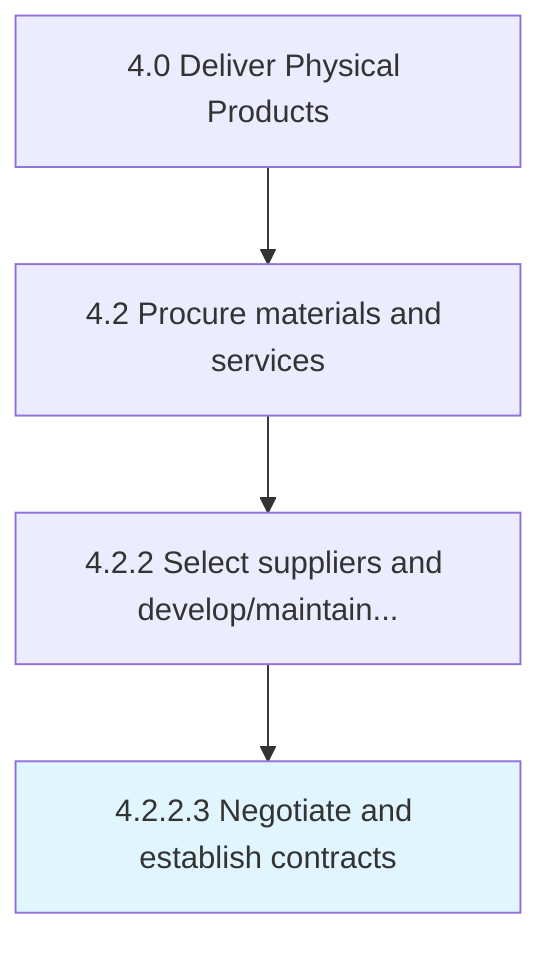

# Negotiate and establish contracts

> Legally binding suppliers with the company.

## Overview

Activity 4.2.2.3 is an activity within the Deliver Physical Products framework. 

Legally binding suppliers with the company. Negotiate contracts individually with all the suppliers that include the promised material delivery, the delivery dates and duration, etc.

## Process Hierarchy



## Key Statistics

| Metric | Value |
|--------|-------|
| APQC Code | 10290 |
| Hierarchy ID | 4.2.2.3 |
| Level | Activity |
| Parent | [4.2.2](../) |
| Sub-Processes | 0 |


## GraphDL Semantic Structure

```
negotiate.AndEstablishContracts
```

| Component | Value | Description |
|-----------|-------|-------------|
| Verb | `negotiate` | Primary action |
| Object | `and establish contracts` | Direct object |


## Related Concepts

- Contracts
- Contracts


---

*Source: APQC PCF 10290 (4.2.2.3) - APQC*
