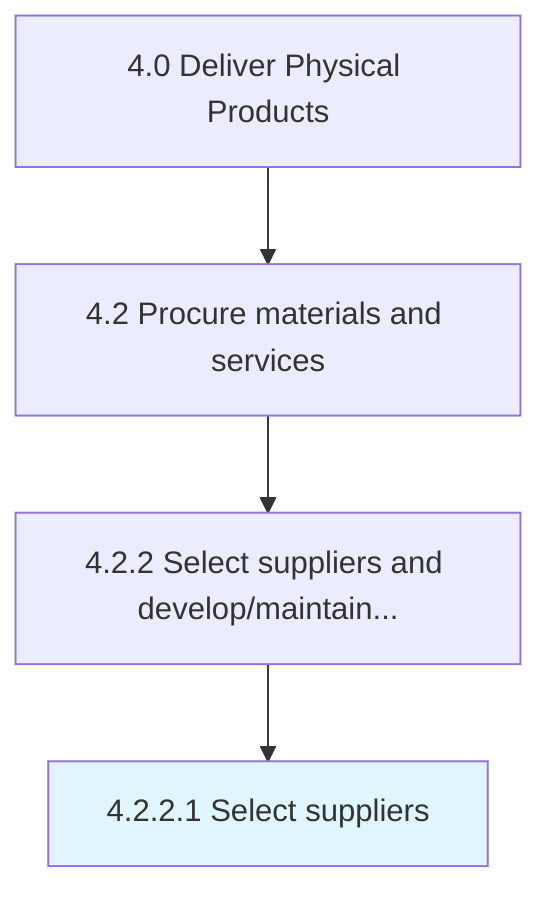

# Select suppliers

> Evaluating the pros and cons of various suppliers.

## Overview

Activity 4.2.2.1 is an activity within the Deliver Physical Products framework. 

Evaluating the pros and cons of various suppliers. Choose the most appropriate and cost-effective suppliers on the basis of their material quality, delivery schedules, and costs.

## Process Hierarchy



## Key Statistics

| Metric | Value |
|--------|-------|
| APQC Code | 10288 |
| Hierarchy ID | 4.2.2.1 |
| Level | Activity |
| Parent | [4.2.2](../) |
| Sub-Processes | 0 |


## GraphDL Semantic Structure

```
select.Suppliers
```

| Component | Value | Description |
|-----------|-------|-------------|
| Verb | `select` | Primary action |
| Object | `suppliers` | Direct object |


## Related Concepts

- Suppliers


---

*Source: APQC PCF 10288 (4.2.2.1) - APQC*
