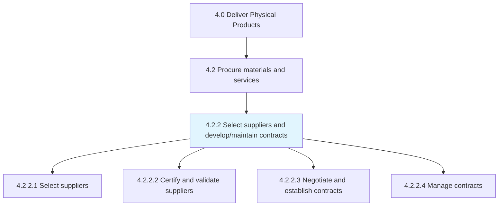
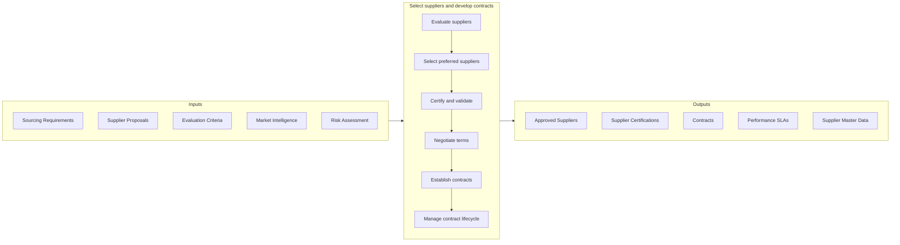

# Select suppliers and develop/maintain contracts

> Evaluating supplier options to select the most effective and efficient suppliers.

## Overview

Process 4.2.2 is a core process within [Procure Materials and Services](../) that establishes the supplier base through rigorous evaluation, selection, and contractual relationships. This process ensures the organization partners with suppliers who can reliably deliver quality materials and services at competitive prices while managing supply chain risk.

Effective supplier selection balances multiple criteria including cost, quality, delivery capability, financial stability, innovation potential, and sustainability practices. The contracting process formalizes these relationships with clear terms, performance expectations, and governance mechanisms. Well-managed supplier relationships become sources of competitive advantage through improved quality, reduced costs, and innovation partnership.

## Process Hierarchy



## Key Statistics

| Metric | Value |
|--------|-------|
| APQC Code | 10278 |
| Hierarchy ID | 4.2.2 |
| Level | Process |
| Parent | [4.2](../) |
| Sub-Processes | 4 |

## GraphDL Semantic Structure

```graphdl
select.Suppliers.for.Contracts
```

| Component | Value | Description |
|-----------|-------|-------------|
| Verb | `select` | Primary action of choosing |
| Object | `Suppliers` | Vendor partners |
| Preposition | `for` | Purpose relationship |
| PrepObject | `Contracts` | Formal agreements |

## Process Flow



## Sub-Processes

| Process | Hierarchy ID | Description |
|---------|-------------|-------------|
| [Select suppliers](./SelectSuppliers) | 4.2.2.1 | Evaluating and choosing suppliers based on comprehensive criteria |
| [Certify and validate suppliers](./CertifyAndValidateSuppliers) | 4.2.2.2 | Verifying supplier capabilities and approving for production supply |
| [Negotiate and establish contracts](./NegotiateAndEstablishContracts) | 4.2.2.3 | Formalizing supplier relationships with contractual agreements |
| [Manage contracts](./ManageContracts) | 4.2.2.4 | Administering contracts through their lifecycle including renewals |

## RACI Matrix

| Activity | Responsible | Accountable | Consulted | Informed |
|----------|-------------|-------------|-----------|----------|
| Define selection criteria | Category Manager | CPO | Quality, Engineering | Finance |
| Evaluate suppliers | Sourcing Team | Category Manager | Quality, Operations | Suppliers |
| Conduct supplier audits | Quality/Procurement | Category Manager | Engineering | Supplier |
| Negotiate contracts | Category Manager | CPO | Legal, Finance | Operations |
| Execute contracts | Legal/Procurement | CPO | Category Manager | Suppliers |
| Manage contract compliance | Category Manager | CPO | Legal | Finance |

## Key Stakeholders

- **Procurement/Sourcing**: Leads selection and contracting
- **Legal**: Reviews and approves contract terms
- **Quality**: Validates supplier quality capabilities
- **Finance**: Evaluates supplier financial stability and terms
- **Operations**: Provides requirements and receives supply
- **Suppliers**: Partners seeking business relationships

## Metrics and KPIs

| Metric | Description | Target |
|--------|-------------|--------|
| Supplier Lead Time | Time from RFQ to contract execution | <90 days |
| Supplier Quality Rate | Percentage of supplies meeting specifications | >99% |
| Cost Savings | Negotiated savings vs. baseline | >5% annually |
| Contract Compliance | Adherence to contract terms | >98% |
| Supplier Diversity | Spend with diverse suppliers | Per policy |
| Single Source Risk | Categories with single supplier | <10% |
| Contract Renewal Rate | Suppliers renewed vs. replaced | >80% |
| Supplier Audit Pass Rate | Suppliers passing quality audits | >95% |

## Related Departments

- [Procurement](/departments/Procurement) - Sourcing and contracting
- [Legal](/departments/Legal) - Contract review and management
- [Quality Assurance](/departments/Quality) - Supplier quality verification
- [Finance](/departments/Finance) - Financial analysis and payment

## Related Occupations

- [Purchasing Managers](/occupations/Management/PurchasingManagers) - Procurement leadership
- [Purchasing Agents](/occupations/Business/PurchasingAgents) - Supplier management
- [Contract Specialists](/occupations/Business/ContractSpecialists) - Contract administration
- [Lawyers](/occupations/Legal/Lawyers) - Contract negotiation

## Industry Variations

### Automotive
Extensive supplier development programs, IATF 16949 certification requirements, and long-term partnership models with tiered supplier structures.

### Retail
Focus on cost negotiation, seasonal contracting, private label supplier development, and ethical sourcing compliance.

### Technology
IP protection clauses, rapid qualification processes for new suppliers, and flexibility for component changes.

### Aerospace
Rigorous supplier certification (Nadcap), long approval timelines, and special process qualification requirements.

## Related Concepts

- SupplierSelection
- ContractManagement
- SupplierCertification
- StrategicSourcing
- VendorManagement
- SupplyChainRisk
- SupplierDevelopment

---

*Source: APQC PCF 10278 (4.2.2) - APQC*
