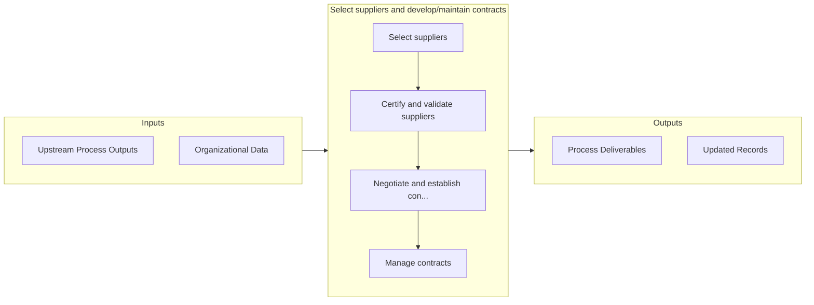

# Select suppliers and develop/maintain contracts

> Evaluating supplier options to select the most effective and efficient suppliers.

## Overview

Process 4.2.2 is a core process that defines the specific procedures for select suppliers and develop/maintain contracts. 

Evaluating supplier options to select the most effective and efficient suppliers. Validate selected suppliers. Establish and manage supplier contracts.

## Process Hierarchy


## Key Statistics

| Metric | Value |
|--------|-------|
| APQC Code | 10278 |
| Hierarchy ID | 4.2.2 |
| Level | Process |
| Parent | [4.2](../) |
| Sub-Processes | 4 |


## GraphDL Semantic Structure

```graphdl
select.SuppliersAndDevelopmaintainContracts
```

| Component | Value | Description |
|-----------|-------|-------------|
| Verb | `select` | Primary action |
| Object | `suppliers and develop/maintain contracts` | Direct object |


## Process Flow



## Sub-Processes

| Process | Hierarchy ID | Description |
|---------|-------------|-------------|
| [Select suppliers](./SelectSuppliers) | 4.2.2.1 | Evaluating the pros and cons of various suppliers |
| [Certify and validate suppliers](./CertifyAndValidateSuppliers) | 4.2.2.2 | Validating the supply sources, and provide certification as an official supplier |
| [Negotiate and establish contracts](./NegotiateAndEstablishContracts) | 4.2.2.3 | Legally binding suppliers with the company |
| [Manage contracts](./ManageContracts) | 4.2.2.4 | Keeping contracts up-to-date with routine evaluation |


## Related Concepts

- SuppliersContracts
- DevelopContracts
- MaintainContracts


---

*Source: APQC PCF 10278 (4.2.2) - APQC*
