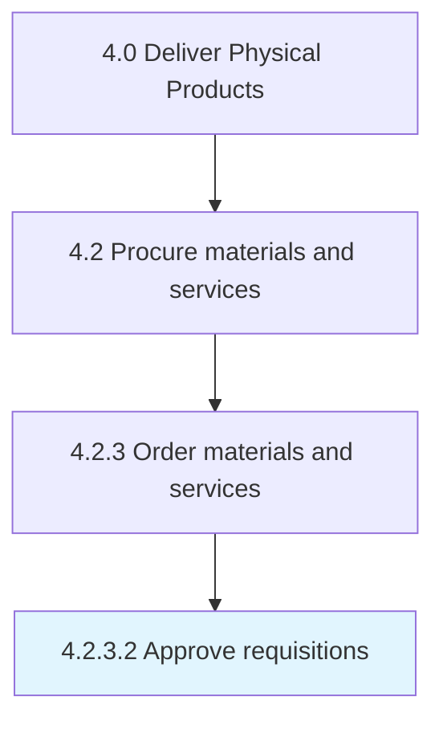

# Approve requisitions

> Approving requisitions for materials and services.

## Overview

Activity 4.2.3.2 is an activity within the Deliver Physical Products framework. 

Approving requisitions for materials and services. Examine distributor-specific requests, and validate them individually.

## Process Hierarchy



## Key Statistics

| Metric | Value |
|--------|-------|
| APQC Code | 10293 |
| Hierarchy ID | 4.2.3.2 |
| Level | Activity |
| Parent | [4.2.3](../) |
| Sub-Processes | 0 |


## GraphDL Semantic Structure

```
approve.Requisitions
```

| Component | Value | Description |
|-----------|-------|-------------|
| Verb | `approve` | Primary action |
| Object | `requisitions` | Direct object |


## Related Concepts

- Requisitions


---

*Source: APQC PCF 10293 (4.2.3.2) - APQC*
