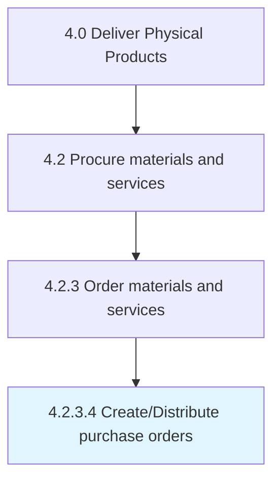

# Create/Distribute purchase orders

> Creating and placing the orders for purchasing materials and services from suppliers.

## Overview

Activity 4.2.3.4 is an activity within the Deliver Physical Products framework. 

Creating and placing the orders for purchasing materials and services from suppliers. Analyze vendor quotes. Choose the most cost-effective vendors. Create vendor-specific orders. Distribute them in order to initiate the purchasing process.

## Process Hierarchy



## Key Statistics

| Metric | Value |
|--------|-------|
| APQC Code | 10295 |
| Hierarchy ID | 4.2.3.4 |
| Level | Activity |
| Parent | [4.2.3](../) |
| Sub-Processes | 0 |


## GraphDL Semantic Structure

```
create/distribute.PurchaseOrders
```

| Component | Value | Description |
|-----------|-------|-------------|
| Verb | `create/distribute` | Primary action |
| Object | `purchase orders` | Direct object |


## Related Concepts

- PurchaseOrders
- PurchaseOrders


---

*Source: APQC PCF 10295 (4.2.3.4) - APQC*
