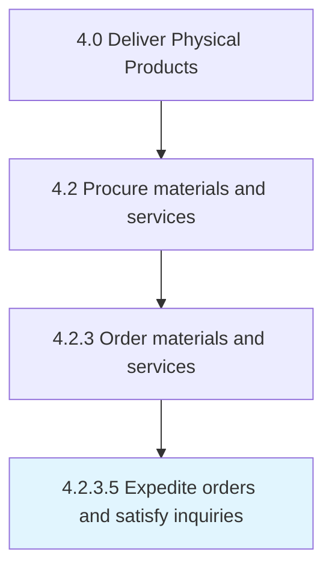

# Expedite orders and satisfy inquiries

> Accelerating the purchase orders in order to fulfill the internal needs (for raw materials) depicted through inquiries.

## Overview

Activity 4.2.3.5 is an activity within the Deliver Physical Products framework. 

Accelerating the purchase orders in order to fulfill the internal needs (for raw materials) depicted through inquiries.

## Process Hierarchy



## Key Statistics

| Metric | Value |
|--------|-------|
| APQC Code | 10296 |
| Hierarchy ID | 4.2.3.5 |
| Level | Activity |
| Parent | [4.2.3](../) |
| Sub-Processes | 0 |


## GraphDL Semantic Structure

```
expedite.OrdersAndSatisfyInquiries
```

| Component | Value | Description |
|-----------|-------|-------------|
| Verb | `expedite` | Primary action |
| Object | `orders and satisfy inquiries` | Direct object |


## Related Concepts

- OrdersInquiries
- SatisfyInquiries


---

*Source: APQC PCF 10296 (4.2.3.5) - APQC*
