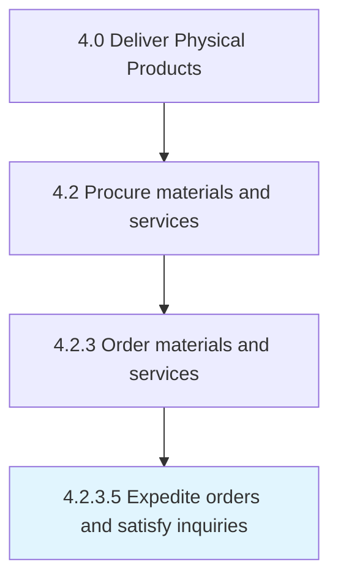
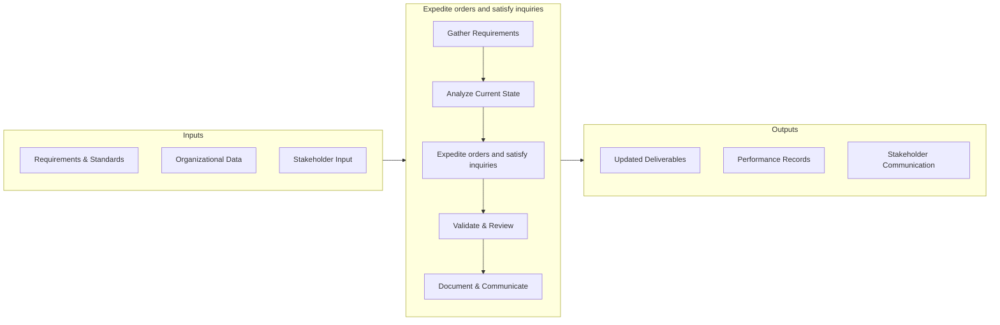

# Expedite orders and satisfy inquiries

> Accelerating the purchase orders in order to fulfill the internal needs (for raw materials) depicted through inquiries.

## Overview

This activity encompasses the end-to-end process of expedite orders and satisfy inquiries within the supply chain and physical product delivery domain. It involves coordinating cross-functional teams, applying standardized methodologies, and leveraging organizational data to ensure consistent and effective outcomes. The process is aligned with the broader Deliver Physical Products framework (APQC 4.2.3.5) and supports strategic objectives by translating operational requirements into actionable procedures.

Effective execution of this activity requires clear ownership, well-defined inputs and outputs, and continuous monitoring against established benchmarks. Organizations that excel at this process typically integrate it with upstream planning activities and downstream performance measurement, creating a feedback loop that drives ongoing improvement and adaptation to changing business conditions.


## Process Hierarchy



## Key Statistics

| Metric | Value |
|--------|-------|
| APQC Code | 10296 |
| Hierarchy ID | 4.2.3.5 |
| Level | Activity |
| Parent | [4.2.3](../) |
| Sub-Processes | 0 |


## GraphDL Semantic Structure

```graphdl
expedite.OrdersAndSatisfyInquiries
```

| Component | Value | Description |
|-----------|-------|-------------|
| Verb | `expedite` | Primary action |
| Object | `orders and satisfy inquiries` | Direct object |


## Process Flow



## RACI Matrix

| Activity | Production Manager | Supply Chain Director | Quality Assurance Team | Finance Department |
|----------|:-:|:-:|:-:|:-:|
| Gather Requirements | R | A | C | I |
| Analyze Current State | R | I | C | I |
| Expedite orders and satisfy inquiries | R | A | C | I |
| Validate & Review | C | A | R | I |
| Document & Communicate | R | I | I | C |

## Related Occupations

- [Supply Chain Manager](/occupations/Management/SupplyChainManagers)
- [Logistics Analyst](/occupations/Business/LogisticsAnalysts)
- [Production Manager](/occupations/ProductionManagers)
- [Warehouse Manager](/occupations/WarehouseManagers)

## Related Departments

- Supply Chain & Logistics
- Manufacturing & Production
- Quality Assurance

## Industry Variations

### Manufacturing
Emphasis on lean production, JIT inventory, and continuous improvement methodologies such as Six Sigma and Kaizen.

### Retail
Focus on omnichannel fulfillment, last-mile delivery optimization, and seasonal demand management.

### Automotive
Integration of complex multi-tier supplier networks with assembly line synchronization and recall management.

## KPIs & Metrics

| KPI | Description | Unit |
|-----|-------------|------|
| Cycle Time | Average time to complete expedite orders and satisfy inquiries process | Hours/Days |
| Completion Rate | Percentage of orders and satisfy inquiries activities completed on schedule | % |
| Quality Score | Accuracy and quality rating of orders and satisfy inquiries outputs | 1-10 Scale |
| Cost Efficiency | Cost per unit of orders and satisfy inquiries processed | $/Unit |
| On-Time Delivery | Percentage of deliverables completed within target timeline | % |

## Related Concepts

- OrdersInquiries
- SatisfyInquiries


---

*Source: APQC PCF 10296 (4.2.3.5) - APQC*
