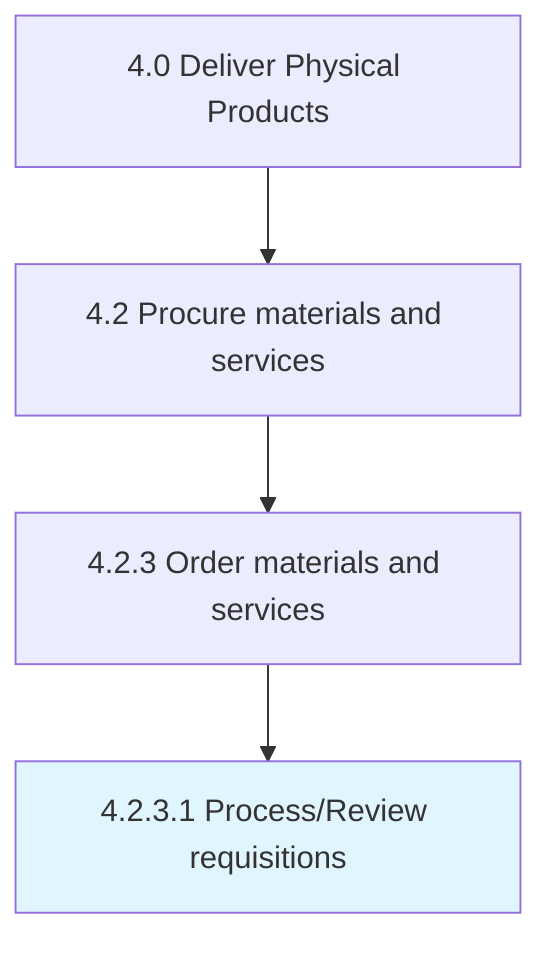

# Process/Review requisitions

> Handling operations related to processing/reviewing the requisitions.

## Overview

Activity 4.2.3.1 is an activity within the Deliver Physical Products framework. 

Handling operations related to processing/reviewing the requisitions. Establish and maintain procedures for the initiation, authorization, and processing of purchase requirements to procure products/services.

## Process Hierarchy



## Key Statistics

| Metric | Value |
|--------|-------|
| APQC Code | 10292 |
| Hierarchy ID | 4.2.3.1 |
| Level | Activity |
| Parent | [4.2.3](../) |
| Sub-Processes | 0 |


## GraphDL Semantic Structure

```
process/review.Requisitions
```

| Component | Value | Description |
|-----------|-------|-------------|
| Verb | `process/review` | Primary action |
| Object | `requisitions` | Direct object |


## Related Concepts

- [Requisitions](/concepts/Requisitions)
- [Requisitions](/concepts/Requisitions)


---

*Source: APQC PCF 10292 (4.2.3.1) - APQC*
