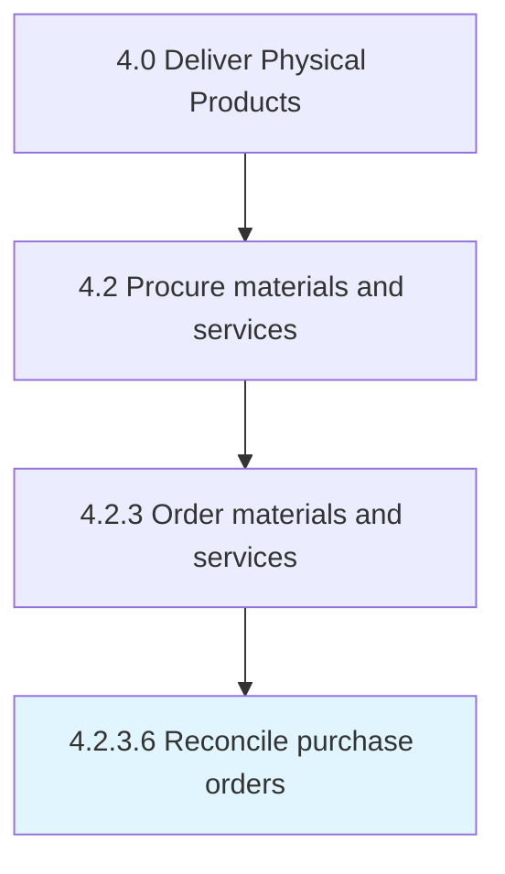

# Reconcile purchase orders

> Verify that purchase orders are filled as expected: verify that items and quantities are delivered as expected, based on purchase order details and goods receipts.

## Overview

Activity 4.2.3.6 is an activity within the Deliver Physical Products framework. 

Verify that purchase orders are filled as expected: verify that items and quantities are delivered as expected, based on purchase order details and goods receipts.

## Process Hierarchy



## Key Statistics

| Metric | Value |
|--------|-------|
| APQC Code | 10297 |
| Hierarchy ID | 4.2.3.6 |
| Level | Activity |
| Parent | [4.2.3](../) |
| Sub-Processes | 0 |


## GraphDL Semantic Structure

```
reconcile.PurchaseOrders
```

| Component | Value | Description |
|-----------|-------|-------------|
| Verb | `reconcile` | Primary action |
| Object | `purchase orders` | Direct object |


## Related Concepts

- PurchaseOrders


---

*Source: APQC PCF 10297 (4.2.3.6) - APQC*
