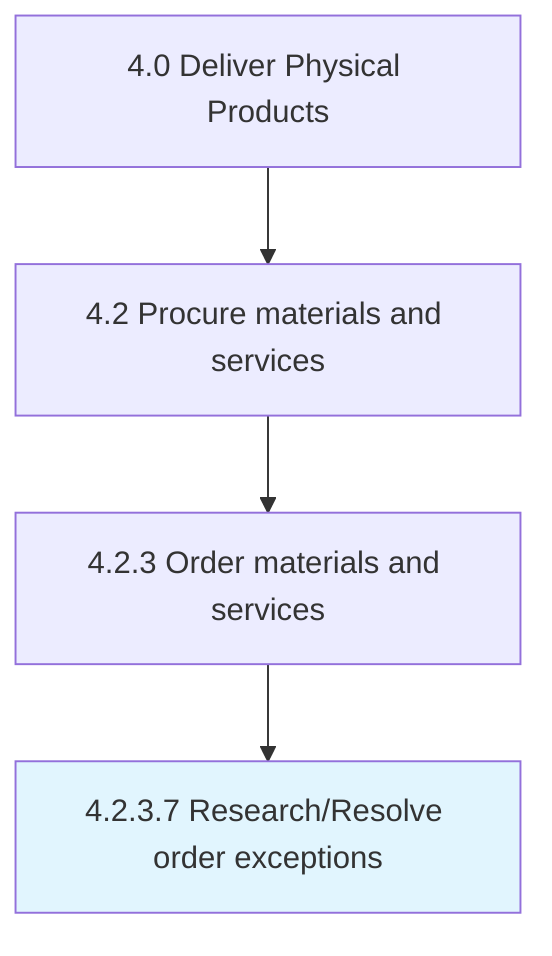

# Research/Resolve order exceptions

> Identifying and resolving any exceptions.

## Overview

Activity 4.2.3.7 is an activity within the Deliver Physical Products framework. 

Identifying and resolving any exceptions. Address the internal needs/inquiries for materials that cannot be procured immediately. Research inquiries that require the need of exceptional materials.

## Process Hierarchy



## Key Statistics

| Metric | Value |
|--------|-------|
| APQC Code | 10298 |
| Hierarchy ID | 4.2.3.7 |
| Level | Activity |
| Parent | [4.2.3](../) |
| Sub-Processes | 0 |


## GraphDL Semantic Structure

```
research/resolve.OrderExceptions
```

| Component | Value | Description |
|-----------|-------|-------------|
| Verb | `research/resolve` | Primary action |
| Object | `order exceptions` | Direct object |


## Related Concepts

- [OrderExceptions](/concepts/OrderExceptions)
- [OrderExceptions](/concepts/OrderExceptions)


---

*Source: APQC PCF 10298 (4.2.3.7) - APQC*
