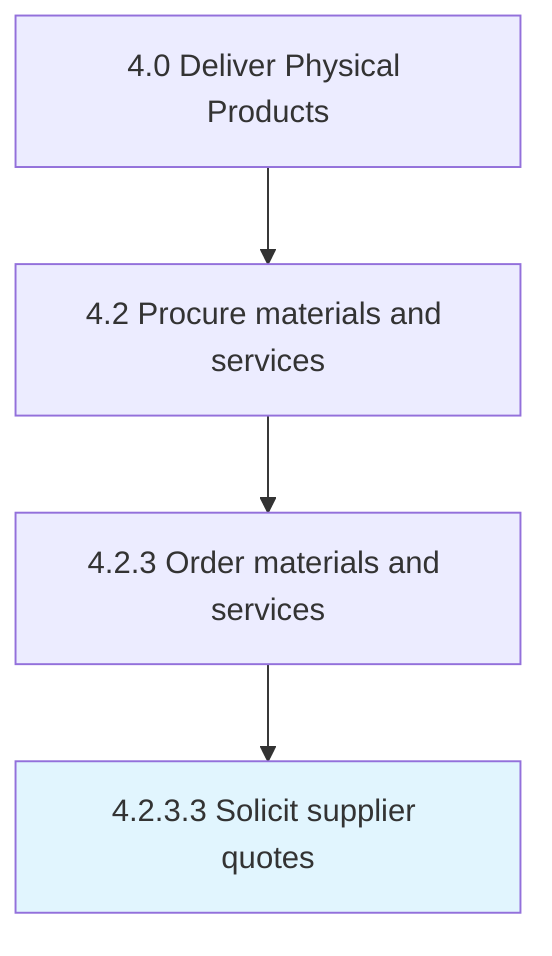

# Solicit supplier quotes

> Requesting quotes from suppliers.

## Overview

Activity 4.2.3.3 is an activity within the Deliver Physical Products framework. 

Requesting quotes from suppliers. Use a request for quotation (RFQ) to invite suppliers into a bidding process for specific products/services.

## Process Hierarchy



## Key Statistics

| Metric | Value |
|--------|-------|
| APQC Code | 10294 |
| Hierarchy ID | 4.2.3.3 |
| Level | Activity |
| Parent | [4.2.3](../) |
| Sub-Processes | 0 |


## GraphDL Semantic Structure

```
solicit.SupplierQuotes
```

| Component | Value | Description |
|-----------|-------|-------------|
| Verb | `solicit` | Primary action |
| Object | `supplier quotes` | Direct object |


## Related Concepts

- SupplierQuotes


---

*Source: APQC PCF 10294 (4.2.3.3) - APQC*
