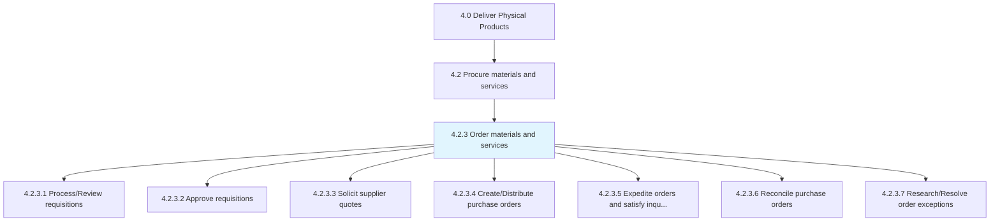
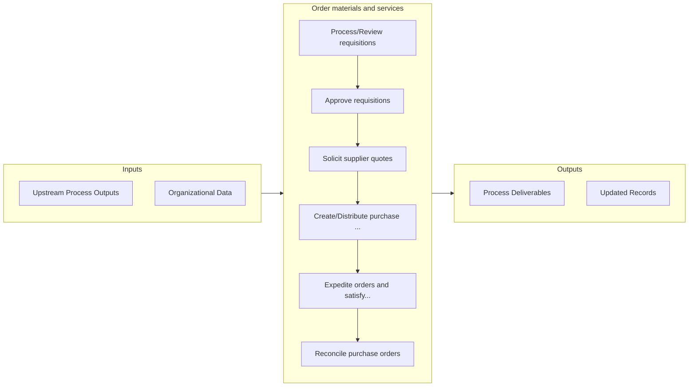

# Order materials and services

> Creating and approving requisitions and distributing purchase orders accordingly.

## Overview

Process 4.2.3 is a core process that defines the specific procedures for order materials and services. 

Creating and approving requisitions and distributing purchase orders accordingly. Hasten the procurement process to satisfy internal needs.

## Process Hierarchy



## Key Statistics

| Metric | Value |
|--------|-------|
| APQC Code | 10279 |
| Hierarchy ID | 4.2.3 |
| Level | Process |
| Parent | [4.2](../) |
| Sub-Processes | 7 |


## GraphDL Semantic Structure

```graphdl
order.MaterialsAndServices
```

| Component | Value | Description |
|-----------|-------|-------------|
| Verb | `order` | Primary action |
| Object | `materials and services` | Direct object |


## Process Flow



## Sub-Processes

| Process | Hierarchy ID | Description |
|---------|-------------|-------------|
| [Process/Review requisitions](./ProcessReviewRequisitions) | 4.2.3.1 | Handling operations related to processing/reviewing the requisitions |
| [Approve requisitions](./ApproveRequisitions) | 4.2.3.2 | Approving requisitions for materials and services |
| [Solicit supplier quotes](./SolicitSupplierQuotes) | 4.2.3.3 | Requesting quotes from suppliers |
| [Create/Distribute purchase orders](./CreateDistributePurchaseOrders) | 4.2.3.4 | Creating and placing the orders for purchasing materials and services from suppliers |
| [Expedite orders and satisfy inquiries](./ExpediteOrdersAndSatisfyInquiries) | 4.2.3.5 | Accelerating the purchase orders in order to fulfill the internal needs (for raw materials) depicted |
| [Reconcile purchase orders](./ReconcilePurchaseOrders) | 4.2.3.6 | Verify that purchase orders are filled as expected: verify that items and quantities are delivered a |
| [Research/Resolve order exceptions](./ResearchResolveOrderExceptions) | 4.2.3.7 | Identifying and resolving any exceptions |


## Related Concepts

- Materials
- Services


---

*Source: APQC PCF 10279 (4.2.3) - APQC*
