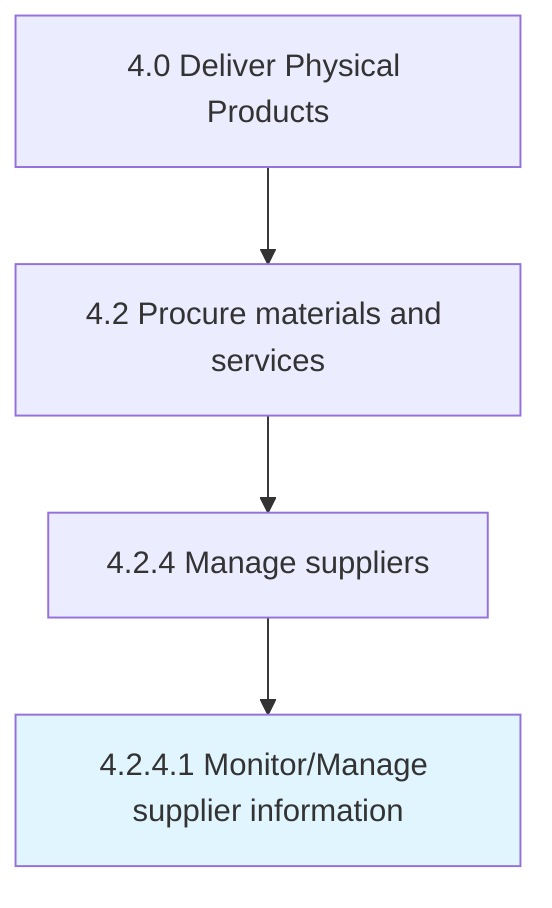

# Monitor/Manage supplier information

> Examining procurement and vendor performance.

## Overview

Activity 4.2.4.1 is an activity within the Deliver Physical Products framework. 

Examining procurement and vendor performance. Report delivery timing and the quality of the materials procured through different vendors.

## Process Hierarchy



## Key Statistics

| Metric | Value |
|--------|-------|
| APQC Code | 10299 |
| Hierarchy ID | 4.2.4.1 |
| Level | Activity |
| Parent | [4.2.4](../) |
| Sub-Processes | 0 |


## GraphDL Semantic Structure

```
monitor/manage.SupplierInformation
```

| Component | Value | Description |
|-----------|-------|-------------|
| Verb | `monitor/manage` | Primary action |
| Object | `supplier information` | Direct object |


## Related Concepts

- SupplierInformation
- SupplierInformation


---

*Source: APQC PCF 10299 (4.2.4.1) - APQC*
