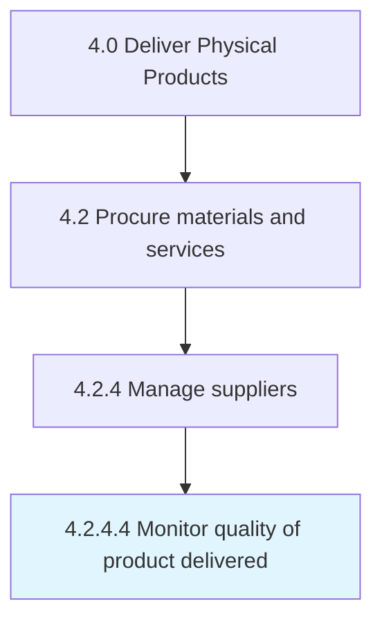

# Monitor quality of product delivered

> Track the performance of the suppliers on product quality.

## Overview

Activity 4.2.4.4 is an activity within the Deliver Physical Products framework. 

Track the performance of the suppliers on product quality. Use this information to further improve sourcing and supplier performance.

## Process Hierarchy



## Key Statistics

| Metric | Value |
|--------|-------|
| APQC Code | 10302 |
| Hierarchy ID | 4.2.4.4 |
| Level | Activity |
| Parent | [4.2.4](../) |
| Sub-Processes | 0 |


## GraphDL Semantic Structure

```
monitor.Quality.of.ProductDelivered
```

| Component | Value | Description |
|-----------|-------|-------------|
| Verb | `monitor` | Primary action |
| Object | `quality` | Direct object |
| Preposition | `of` | Relationship |
| PrepObject | `product delivered` | Indirect object |


## Related Concepts

- Quality
- ProductDelivered


---

*Source: APQC PCF 10302 (4.2.4.4) - APQC*
