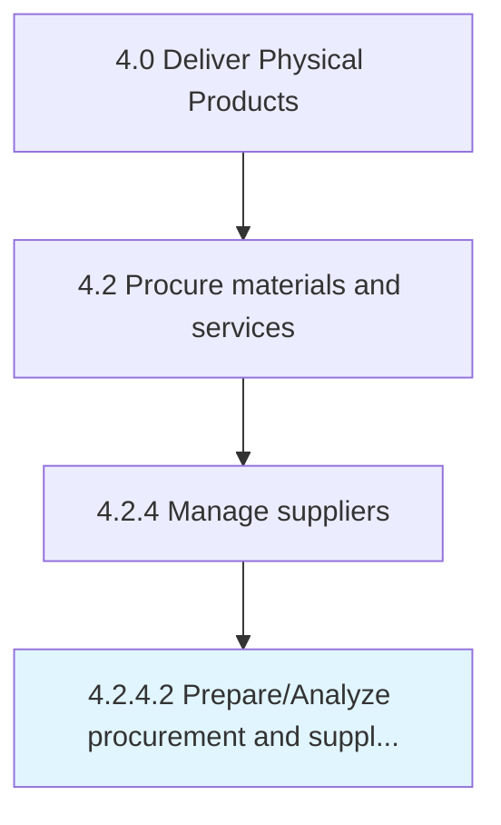

# Prepare/Analyze procurement and supplier performance

> Assisting the production and inventory processes through the information and reports created.

## Overview

Activity 4.2.4.2 is an activity within the Deliver Physical Products framework. 

Assisting the production and inventory processes through the information and reports created. Use the information and metrics of the procurement and vendor performance to enhance or improve the production process.

## Process Hierarchy



## Key Statistics

| Metric | Value |
|--------|-------|
| APQC Code | 10300 |
| Hierarchy ID | 4.2.4.2 |
| Level | Activity |
| Parent | [4.2.4](../) |
| Sub-Processes | 0 |


## GraphDL Semantic Structure

```
prepare/analyze.ProcurementAndSupplierPerformance
```

| Component | Value | Description |
|-----------|-------|-------------|
| Verb | `prepare/analyze` | Primary action |
| Object | `procurement and supplier performance` | Direct object |


## Related Concepts

- ProcurementSupplierPerformance
- ProcurementSupplierPerformance


---

*Source: APQC PCF 10300 (4.2.4.2) - APQC*
