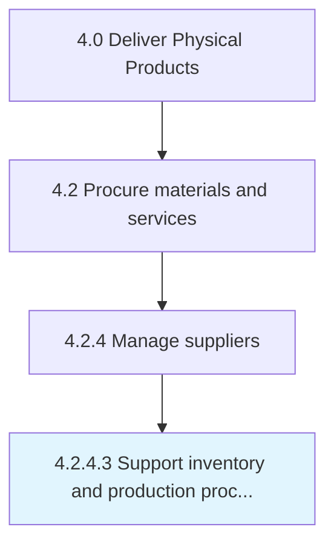

# Support inventory and production processes

> Support inventory and production processes by analyzing impact of procurement decisions and collaborating to constantly improve.

## Overview

Activity 4.2.4.3 is an activity within the Deliver Physical Products framework. 

Support inventory and production processes by analyzing impact of procurement decisions and collaborating to constantly improve. (For example, perhaps minimum order requirements could be negotiated to be lower, to reduce excessive inventory and make production more flexible.)

## Process Hierarchy



## Key Statistics

| Metric | Value |
|--------|-------|
| APQC Code | 10301 |
| Hierarchy ID | 4.2.4.3 |
| Level | Activity |
| Parent | [4.2.4](../) |
| Sub-Processes | 0 |


## GraphDL Semantic Structure

```
support.InventoryAndProductionProcesses
```

| Component | Value | Description |
|-----------|-------|-------------|
| Verb | `support` | Primary action |
| Object | `inventory and production processes` | Direct object |


## Related Concepts

- [InventoryProcesses](/concepts/InventoryProcesses)
- [ProductionProcesses](/concepts/ProductionProcesses)


---

*Source: APQC PCF 10301 (4.2.4.3) - APQC*
