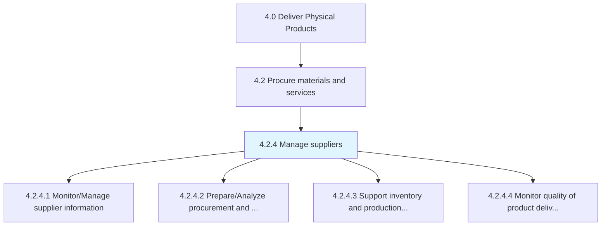
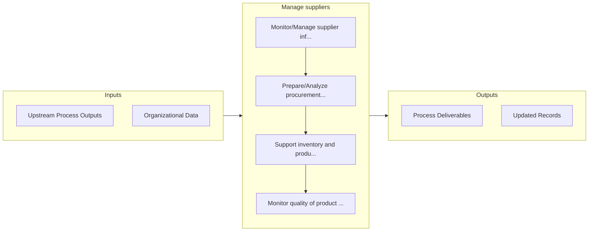

# Manage suppliers

> Collecting and analyzing new information in order to track and rate suppliers through a supplier information management system.

## Overview

Process 4.2.4 is a core process that defines the specific procedures for manage suppliers. 

Collecting and analyzing new information in order to track and rate suppliers through a supplier information management system.

## Process Hierarchy



## Key Statistics

| Metric | Value |
|--------|-------|
| APQC Code | 10280 |
| Hierarchy ID | 4.2.4 |
| Level | Process |
| Parent | [4.2](../) |
| Sub-Processes | 4 |


## GraphDL Semantic Structure

```
manage.Suppliers
```

| Component | Value | Description |
|-----------|-------|-------------|
| Verb | `manage` | Primary action |
| Object | `suppliers` | Direct object |


## Process Flow



## Sub-Processes

| Process | Hierarchy ID | Description |
|---------|-------------|-------------|
| [Monitor/Manage supplier information](./MonitorManageSupplierInformation) | 4.2.4.1 | Examining procurement and vendor performance |
| [Prepare/Analyze procurement and supplier performance](./PrepareAnalyzeProcurementAndSupplierPerformance) | 4.2.4.2 | Assisting the production and inventory processes through the information and reports created |
| [Support inventory and production processes](./SupportInventoryAndProductionProcesses) | 4.2.4.3 | Support inventory and production processes by analyzing impact of procurement decisions and collabor |
| [Monitor quality of product delivered](./MonitorQualityOfProductDelivered) | 4.2.4.4 | Track the performance of the suppliers on product quality |


## Related Concepts

- [Suppliers](/concepts/Suppliers)


---

*Source: APQC PCF 10280 (4.2.4) - APQC*
