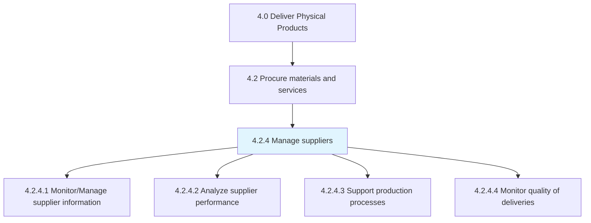
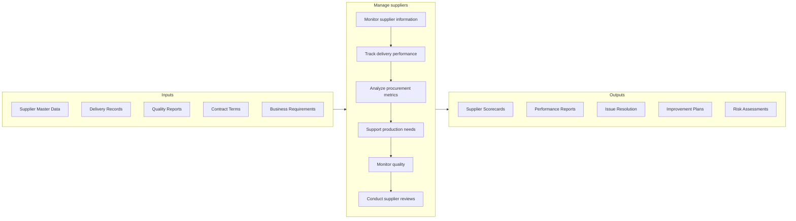

# Manage suppliers

> Collecting and analyzing new information in order to track and rate suppliers through a supplier information management system.

## Overview

Process 4.2.4 is a core process within [Procure Materials and Services](../) that maintains ongoing supplier relationships through performance monitoring, issue resolution, and continuous improvement. This process ensures suppliers deliver according to commitments while identifying opportunities to enhance value and mitigate risks.

Effective supplier management transforms transactional purchasing relationships into strategic partnerships. The process includes maintaining accurate supplier data, measuring and reviewing performance, addressing issues proactively, collaborating on improvements, and developing supplier capabilities. Strong supplier management reduces supply chain risks, improves quality, and drives cost reduction through partnership rather than adversarial negotiations.

## Process Hierarchy



## Key Statistics

| Metric | Value |
|--------|-------|
| APQC Code | 10280 |
| Hierarchy ID | 4.2.4 |
| Level | Process |
| Parent | [4.2](../) |
| Sub-Processes | 4 |

## GraphDL Semantic Structure

```graphdl
manage.Suppliers.for.Performance
```

| Component | Value | Description |
|-----------|-------|-------------|
| Verb | `manage` | Primary action of overseeing |
| Object | `Suppliers` | Vendor partners |
| Preposition | `for` | Purpose relationship |
| PrepObject | `Performance` | Delivery and quality outcomes |

## Process Flow



## Sub-Processes

| Process | Hierarchy ID | Description |
|---------|-------------|-------------|
| [Monitor/Manage supplier information](./MonitorManageSupplierInformation) | 4.2.4.1 | Maintaining accurate supplier data and tracking key information |
| [Prepare/Analyze procurement and supplier performance](./PrepareAnalyzeProcurementAndSupplierPerformance) | 4.2.4.2 | Creating scorecards and analytics on supplier performance |
| [Support inventory and production processes](./SupportInventoryAndProductionProcesses) | 4.2.4.3 | Collaborating with suppliers to meet operational requirements |
| [Monitor quality of product delivered](./MonitorQualityOfProductDelivered) | 4.2.4.4 | Tracking supplier quality metrics and addressing issues |

## RACI Matrix

| Activity | Responsible | Accountable | Consulted | Informed |
|----------|-------------|-------------|-----------|----------|
| Maintain supplier data | Procurement Operations | Category Manager | IT | Suppliers |
| Track delivery performance | Procurement/Logistics | Category Manager | Operations | Quality |
| Analyze performance metrics | Procurement Analytics | CPO | Category Managers | Leadership |
| Conduct supplier reviews | Category Manager | CPO | Quality, Operations | Suppliers |
| Resolve supplier issues | Category Manager | CPO | Quality, Legal | Operations |
| Develop improvement plans | Category Manager | CPO | Quality, Supplier | Leadership |

## Key Stakeholders

- **Category Managers**: Owns supplier relationships and performance
- **Procurement Operations**: Maintains data and processes transactions
- **Quality Assurance**: Monitors and addresses quality issues
- **Operations/Production**: Consumes supplier deliveries
- **Finance**: Tracks supplier costs and payment performance
- **Suppliers**: Partners in relationship

## Metrics and KPIs

| Metric | Description | Target |
|--------|-------------|--------|
| On-Time Delivery | Deliveries meeting scheduled dates | >98% |
| Quality Acceptance Rate | Deliveries passing quality inspection | >99% |
| Cost Variance | Actual vs. contracted pricing | <1% |
| Lead Time Performance | Actual vs. quoted lead times | Within SLA |
| Supplier Responsiveness | Time to resolve issues | <48 hours |
| Supplier Scorecard Rating | Composite performance score | >85% |
| Corrective Action Closure | SCAR closure within target | >90% |
| Supply Risk Score | Risk assessment rating | Low/Medium |

## Related Departments

- [Procurement](/departments/Procurement) - Supplier relationship ownership
- [Quality Assurance](/departments/Quality) - Supplier quality monitoring
- [Operations](/departments/Operations) - Supplier delivery coordination
- [Finance](/departments/Finance) - Supplier payment and cost tracking

## Related Occupations

- [Purchasing Managers](/occupations/Management/PurchasingManagers) - Supplier oversight
- [Purchasing Agents](/occupations/Business/PurchasingAgents) - Day-to-day management
- [Quality Control Inspectors](/occupations/QualityControlInspectors) - Quality verification
- [Supply Chain Managers](/occupations/Management/SupplyChainManagers) - Strategic alignment

## Industry Variations

### Automotive
Formal supplier development programs, tiered supplier management, and rigorous quality system requirements with regular supplier audits.

### Aerospace
Long-term supplier partnerships, special process certification tracking, and extensive supplier performance documentation.

### Consumer Products
Focus on sustainability and ethical sourcing, supplier diversity programs, and rapid response capabilities for promotional demand.

### Technology
Innovation partnership models, IP protection requirements, and flexibility for component changes and new product introductions.

## Related Concepts

- SupplierRelationshipManagement
- SupplierPerformance
- SupplierDevelopment
- SupplierScorecards
- SupplierRiskManagement
- QualityManagement
- StrategicSourcing

---

*Source: APQC PCF 10280 (4.2.4) - APQC*
