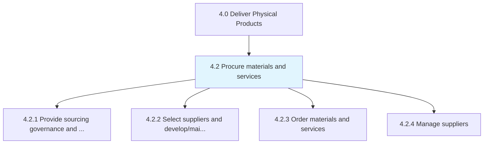
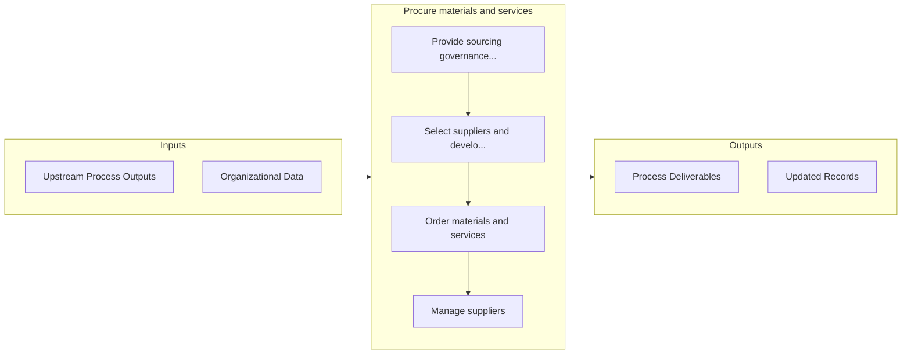

# Procure materials and services

> Creating a plan for procuring materials and services.

## Overview

Group 4.2 is a process group within APQC Category 4.0 (Deliver Physical Products). 

Creating a plan for procuring materials and services. Develop strategies for sourcing materials and services. Choose the most appropriate suppliers, and develop contracts with them. Order the materials and services as per the requirements. Manage relationships with suppliers.

## Process Hierarchy



## Key Statistics

| Metric | Value |
|--------|-------|
| APQC Code | 10216 |
| Hierarchy ID | 4.2 |
| Level | Group |
| Parent | [4](../) |
| Sub-Processes | 4 |


## GraphDL Semantic Structure

```graphdl
procure.MaterialsAndServices
```

| Component | Value | Description |
|-----------|-------|-------------|
| Verb | `procure` | Primary action |
| Object | `materials and services` | Direct object |


## Process Flow



## Sub-Processes

| Process | Hierarchy ID | Description |
|---------|-------------|-------------|
| [Provide sourcing governance and perform category management](./4.2.1-ProvideSourcingGovernancePerform/) | 4.2.1 | Creating strategies for procuring materials and services from various sources, and for managing and  |
| [Select suppliers and develop/maintain contracts](./4.2.2-SelectSuppliersDevelopmaintainContracts/) | 4.2.2 | Evaluating supplier options to select the most effective and efficient suppliers |
| [Order materials and services](./4.2.3-OrderMaterialsServices/) | 4.2.3 | Creating and approving requisitions and distributing purchase orders accordingly |
| [Manage suppliers](./4.2.4-ManageSuppliers/) | 4.2.4 | Collecting and analyzing new information in order to track and rate suppliers through a supplier inf |


## Related Concepts

- Materials
- Services


---

*Source: APQC PCF 10216 (4.2) - APQC*
