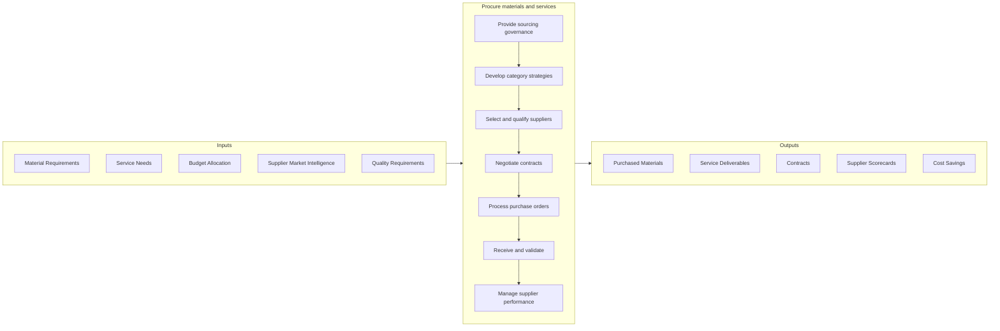

# Procure materials and services

> Creating a plan for procuring materials and services.

## Overview

Group 4.2 is a process group within [Deliver Physical Products](../) that manages the acquisition of all materials, components, and services needed to support production and operations. This process group ensures the organization obtains required inputs at optimal cost, quality, and delivery while managing supply chain risks.

Procurement encompasses strategic sourcing, supplier selection, contract management, and operational purchasing. Modern procurement balances cost reduction with value creation through supplier partnerships, innovation collaboration, sustainability initiatives, and risk management. Effective procurement directly impacts product quality, operational efficiency, and financial performance.

## Process Hierarchy


## Key Statistics

| Metric | Value |
|--------|-------|
| APQC Code | 10216 |
| Hierarchy ID | 4.2 |
| Level | Group |
| Parent | [4](../) |
| Sub-Processes | 4 |

## GraphDL Semantic Structure

```graphdl
procure.Materials.for.Production
```

| Component | Value | Description |
|-----------|-------|-------------|
| Verb | `procure` | Primary action of acquiring |
| Object | `Materials` | Goods and services to purchase |
| Preposition | `for` | Purpose relationship |
| PrepObject | `Production` | Manufacturing operations |

## Process Flow



## Child Processes

| Process | Hierarchy ID | Description |
|---------|-------------|-------------|
| [Provide sourcing governance and category management](./4.2.1-ProvideSourcingGovernancePerform/) | 4.2.1 | Establishing procurement strategies, policies, and category expertise |
| [Select suppliers and develop/maintain contracts](./4.2.2-SelectSuppliersDevelopmaintainContracts/) | 4.2.2 | Evaluating, selecting, and contracting with suppliers |
| [Order materials and services](./4.2.3-OrderMaterialsServices/) | 4.2.3 | Executing purchase transactions from requisition to receipt |
| [Manage suppliers](./4.2.4-ManageSuppliers/) | 4.2.4 | Monitoring and developing supplier relationships and performance |

## RACI Matrix

| Activity | Responsible | Accountable | Consulted | Informed |
|----------|-------------|-------------|-----------|----------|
| Develop sourcing strategy | Strategic Sourcing | CPO | Business Units | Finance |
| Manage categories | Category Managers | CPO | Quality, Engineering | Operations |
| Select and qualify suppliers | Category Managers | CPO | Quality | Operations |
| Negotiate contracts | Category Managers | CPO | Legal | Finance |
| Process purchase orders | Procurement Operations | Procurement Manager | Requisitioners | Suppliers |
| Manage supplier performance | Category Managers | CPO | Quality, Operations | Suppliers |

## Key Stakeholders

- **Chief Procurement Officer (CPO)**: Strategic leadership and governance
- **Category Managers**: Manage categories and supplier relationships
- **Procurement Operations**: Execute transactional purchasing
- **Quality Assurance**: Validates supplier quality
- **Operations/Manufacturing**: Primary internal customers
- **Finance**: Budget management and cost tracking
- **Suppliers**: External partners providing materials and services

## Metrics and KPIs

| Metric | Description | Target |
|--------|-------------|--------|
| Cost Savings | Year-over-year cost reduction | >3% |
| Supplier On-Time Delivery | Deliveries meeting scheduled dates | >98% |
| Supplier Quality | Materials meeting specifications | >99% |
| Purchase Order Cycle Time | Requisition to PO time | <24 hours |
| Spend Under Management | Spend with strategic sourcing | >80% |
| Contract Compliance | Purchases using contracted suppliers | >90% |
| Supplier Diversity | Spend with diverse suppliers | Per policy |
| Procurement Cost Ratio | Procurement cost / total spend | <1% |

## Related Departments

- [Procurement](/departments/Procurement) - Strategic sourcing and purchasing
- [Quality Assurance](/departments/Quality) - Supplier quality management
- [Finance](/departments/Finance) - Cost management and payment
- [Operations](/departments/Operations) - Requirements and consumption
- [Legal](/departments/Legal) - Contract review and compliance

## Related Occupations

- [Purchasing Managers](/occupations/Management/PurchasingManagers) - Procurement leadership
- [Purchasing Agents](/occupations/Business/PurchasingAgents) - Buying operations
- [Contract Specialists](/occupations/Business/ContractSpecialists) - Contract administration
- [Supply Chain Managers](/occupations/Management/SupplyChainManagers) - Integration with operations

## Industry Variations

### Manufacturing
Direct materials focus, JIT delivery requirements, supplier quality integration, and long-term supplier development programs.

### Retail
Merchandise buying, private label sourcing, seasonal purchasing, and vendor-managed inventory programs.

### Healthcare
Medical device and pharmaceutical procurement, GPO participation, and regulatory compliance requirements.

### Construction
Project-based procurement, subcontractor management, and construction materials sourcing.

## Related Concepts

- StrategicSourcing
- CategoryManagement
- SupplierRelationshipManagement
- ContractManagement
- SpendAnalysis
- ProcureToPay
- SupplyChainRisk

---

*Source: APQC PCF 10216 (4.2) - APQC*
