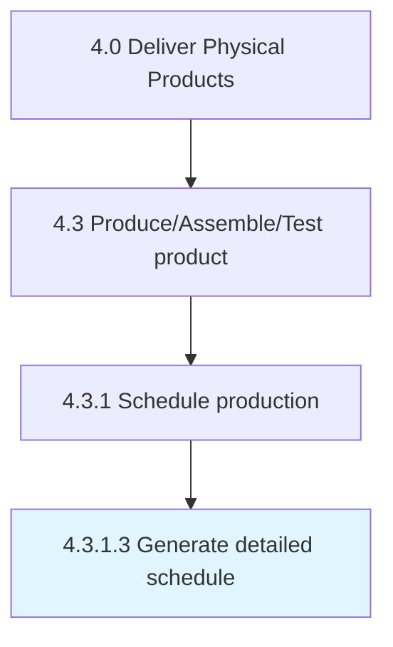

# Generate detailed schedule

> Broadening the line-level plan.

## Overview

Activity 4.3.1.3 is an activity within the Deliver Physical Products framework. 

Broadening the line-level plan. Specify all the individual production processes, along with the timing and the duration to come up with a working schedule that tracks the whole process and any deviations that might occur.

## Process Hierarchy



## Key Statistics

| Metric | Value |
|--------|-------|
| APQC Code | 10307 |
| Hierarchy ID | 4.3.1.3 |
| Level | Activity |
| Parent | [4.3.1](../) |
| Sub-Processes | 0 |


## GraphDL Semantic Structure

```
generate.DetailedSchedule
```

| Component | Value | Description |
|-----------|-------|-------------|
| Verb | `generate` | Primary action |
| Object | `detailed schedule` | Direct object |


## Related Concepts

- [DetailedSchedule](/concepts/DetailedSchedule)


---

*Source: APQC PCF 10307 (4.3.1.3) - APQC*
